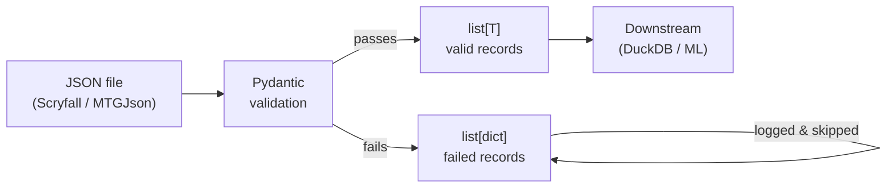

# ADR-001: Pydantic as the Data Validation Layer

## Context

The project ingests large JSON files from two external APIs — Scryfall and MTGJson.
Both APIs are maintained by third parties and can change their schemas without notice.
Each file contains tens to hundreds of thousands of records with deeply nested structures
(e.g. `prices`, `card_faces`, `identifiers`, `legalities`).

Two approaches were considered for parsing and validating incoming data:

**Option A — Pandas-first:** Load JSON directly into a DataFrame and clean/cast columns
manually using `pd.to_numeric`, `fillna`, `astype`, etc.

**Option B — Pydantic-first:** Define typed dataclasses for each source schema and
validate every record against them at load time.

## Decision

Use **Pydantic v2 models** as the canonical data contract for all incoming JSON sources.
Raw records are validated into typed Python objects before any further processing.
Invalid records are collected separately and never silently dropped or corrupted.

## Consequences

### Positive
- Schema is explicit and readable — the model class is the documentation.
- Validation errors are precise: which record, which field, what was wrong.
- Nested structures (`ScryfallCard.prices`, `MtgjsonCard.identifiers`) are modelled
  naturally as sub-models rather than flattened prematurely.
- Breaking API changes are caught immediately at ingest time, not silently propagated.
- Models can be unit-tested independently of any I/O.

### Negative
- More upfront code than a pandas-first approach.
- For very large files (>1M records) validation overhead is measurable.

### Neutral
- `model_dump()` converts Pydantic instances to plain dicts, which DuckDB and pandas
  can consume directly — no adapter code needed.

## Diagram

## Alternatives Considered

| Approach | Reason rejected |
|---|---|
| Pandas-first | Errors are silent (`errors="coerce"`); nested JSON is awkward to flatten |
| Plain dicts | No type safety, no validation, schema invisible until runtime |
| dataclasses (stdlib) | No built-in validation or coercion; would require manual validators |
