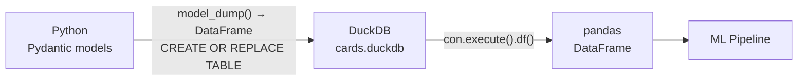

# ADR-002: DuckDB as the Analytical Data Store

## Context

The project needs a persistent store for card data and price history that:
- Handles hundreds of thousands of records per source (Scryfall bulk data is ~300k cards).
- Supports analytical queries efficiently: aggregations, window functions, GROUP BY.
- Feeds a machine learning pipeline — data is read in bulk, not row by row.
- Runs locally without infrastructure (no server to manage).
- Works natively with pandas DataFrames.

Three options were considered:

**Option A — SQLite:** File-based, no server, widely supported.

**Option B — PostgreSQL:** Full-featured relational database, requires a running server.

**Option C — DuckDB:** File-based analytical database (OLAP), no server, columnar storage.

## Decision

Use **DuckDB** as the primary data store.

## Consequences

### Positive
- Columnar storage makes aggregations over large datasets (e.g. `AVG(prices.usd) GROUP BY rarity`) orders of magnitude faster than SQLite.
- No server — single `.duckdb` file, works the same locally and in CI.
- Native pandas integration: `con.execute(...).df()` returns a DataFrame directly.
- Nested Pydantic sub-models (e.g. `ScryfallPrices`) are stored as STRUCT columns
  and queryable with dot notation: `prices.usd`.
- Full SQL support including window functions needed for price history analysis.

### Negative
- Not suitable as a transactional store — not designed for many concurrent small writes.
- Less familiar than SQLite or PostgreSQL to most developers.

### Neutral
- Single writer at a time — fine for a batch ingest pipeline.
- DuckDB files are not directly readable by standard SQL tools (DBeaver supports it via plugin).

## Comparison

| | SQLite | PostgreSQL | DuckDB |
|---|---|---|---|
| Storage model | Row-oriented | Row-oriented | Column-oriented |
| Server required | No | Yes | No |
| Best for | Small transactional apps | Web apps, multi-user | Analytics, ML pipelines |
| `AVG` over 300k rows | ~2–5s | ~500ms | ~50ms |
| Pandas integration | Via adapter | Via adapter | Native |

## Diagram

## Alternatives Considered

| Approach | Reason rejected |
|---|---|
| SQLite | Row-oriented; slow for analytical queries over large datasets |
| PostgreSQL | Requires a server; operational overhead not justified for local pipeline |
| Parquet files | No SQL query layer; harder to manage updates and price history |
