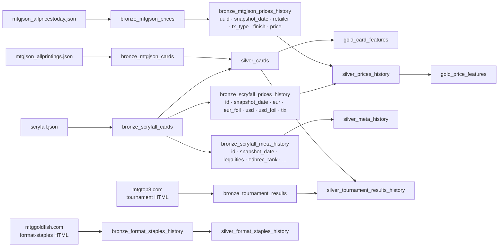

# ADR-003: Medallion Architecture for Data Layers

## Context

Once data is validated and stored in DuckDB it needs to be transformed before it
can be used in a machine learning pipeline. Two strategies were considered:

**Option A — Transform on ingest:** Clean and flatten data before saving to DuckDB.
The database holds only the final, ML-ready representation.

**Option B — Medallion layers:** Store raw data as-is (Bronze), build cleaned tables
on top (Silver), then build ML-ready feature tables on top of those (Gold).
Transformations are applied lazily, after storage.

## Decision

Adopt the **medallion architecture** with three layers, each stored in its own DuckDB
file (`data/bronze/cards.duckdb`, `data/silver/cards.duckdb`, `data/gold/cards.duckdb`).

Raw data is never modified after ingest. Each layer is derived from the one below it
and can be rebuilt independently without re-downloading source files.

A single DuckDB file with three schemas was considered. It was rejected because the
primary operational need is to rebuild one layer in isolation — deleting a single file
and re-running its pipeline is simpler and safer than schema-level isolation inside a
shared file. Cross-layer queries are handled via DuckDB `ATTACH` in interactive sessions.

## Layer Definitions

| Layer | Table prefix | Contents | Who writes it |
|---|---|---|---|
| Bronze | `bronze_` | Raw validated data, close to source schema | `BronzeStorage.populate` / `BronzeStorage.daily_update` |
| Silver | `silver_` | Flattened, cleaned, joined | `SilverStorage.populate` / `SilverStorage.update` |
| Gold | `gold_` | ML-ready features, encoded categoricals | SQL transformation scripts / notebooks |

## Bronze Tables (implemented)

| Table | Write mode | Content |
|---|---|---|
| `bronze_scryfall_cards` | full replace / upsert | All Scryfall card records |
| `bronze_mtgjson_cards` | upsert | All MTGJson card printings |
| `bronze_mtgjson_prices` | full replace | Current MTGJson prices per card UUID |
| `bronze_scryfall_prices_history` | daily append | `id · snapshot_date · eur · eur_foil · usd · usd_foil · tix` (scalar FLOAT columns) |
| `bronze_scryfall_meta_history` | daily append | `id · snapshot_date · legalities · edhrec_rank · reserved · promo_types · finishes` |
| `bronze_mtgjson_prices_history` | daily append | EAV: `uuid · snapshot_date · retailer · tx_type · finish · price` — one row per price point (seeded from AllPrices.json, then daily from AllPricesToday.json) |
| `bronze_tournament_results` | upsert | Top-8 deck card rows from mtgtop8.com |
| `bronze_format_staples_history` | daily append | `id · snapshot_date · format · deck_pct · played · top` |

## Silver Tables (implemented)

| Table | Write mode | Content |
|---|---|---|
| `silver_cards` | full replace / upsert | Unified card table — MTGJson + Scryfall outer join, keyed by `scryfall_id` |
| `silver_prices_history` | append (dedup on `scryfall_id · snapshot_date`) | Flat price history — Scryfall EUR/USD + Cardmarket/TCGPlayer from MTGJson, forward-filled |
| `silver_meta_history` | append (dedup on `id · snapshot_date`) | Scryfall legalities, EDHREC rank, reserved, promo_types, finishes snapshots |
| `silver_format_staples_history` | append (dedup on `id · snapshot_date`) | MTGGoldfish `deck_pct` and `played` per format per day |
| `silver_tournament_results_history` | append (dedup on `id · snapshot_date`) | Top-8 card appearances enriched with `oracle_id` and `scryfall_id` from `silver_cards` |

## Consequences

### Positive
- Bronze is immutable — if a Silver or Gold transformation is wrong, rebuild from Bronze
  without re-downloading JSONs (which can be hundreds of MB).
- Cleaning strategy can change (e.g. `null price → 0` vs `null price → median`) without
  touching stored data.
- Each layer is independently queryable — useful for debugging and exploration.
- Price and metadata history in Bronze is preserved regardless of how Silver/Gold evolve.

### Negative
- More tables to manage.
- Storage footprint is larger (same data exists in multiple representations).

### Neutral
- In DuckDB, Silver and Gold layers can be implemented as `CREATE OR REPLACE TABLE`
  (materialised) or as `CREATE OR REPLACE VIEW` (computed on query). For large datasets
  materialising Silver and Gold is faster at query time.

## Diagram

```mermaid
flowchart TD
    subgraph Ingest
        SF["scryfall.json"]
        MJC["mtgjson_allprintings.json"]
        MJP["mtgjson_allpricestoday.json"]
        PYD["Pydantic validation\n(ingesting_pipeline)"]
        SF & MJC & MJP --> PYD
    end

    subgraph Bronze["data/bronze/cards.duckdb"]
        direction TB
        B1["bronze_scryfall_cards"]
        B2["bronze_mtgjson_cards"]
        B3["bronze_mtgjson_prices"]
        BH1["bronze_scryfall_prices_history"]
        BH2["bronze_scryfall_meta_history"]
        BH3["bronze_mtgjson_prices_history"]
    end

    subgraph Silver["data/silver/cards.duckdb"]
        direction TB
        S1["silver_cards\n(joined, filtered, flat columns)"]
        S2["silver_prices_history\n(flat, no nulls)"]
    end

    subgraph Gold["data/gold/cards.duckdb"]
        direction TB
        G1["gold_card_features\n(encoded, scaled)"]
        G2["gold_price_features\n(rolling avg, trends)"]
    end

    Bronze -->|"ATTACH + SELECT"| Silver
    Silver -->|"ATTACH + SELECT"| Gold
    end

    subgraph ML["ML Pipeline"]
        NB["Jupyter Notebook\n/ training script"]
    end

    PYD -->|"BronzeStorage.populate\nBronzeStorage.daily_update"| Bronze
    Gold --> NB
```

## Data Flow per Source



## Rebuild Strategy

```
If Gold is wrong   → DROP gold_*   → rebuild from silver_*
If Silver is wrong → DROP silver_* → rebuild from bronze_*
If Bronze is wrong → re-run ingesting_pipeline → BronzeStorage.populate → rebuild all layers
```

## Alternatives Considered

| Approach | Reason rejected |
|---|---|
| Transform on ingest | Cannot recover original data if transformation logic changes; price history would be lost on re-ingest |
| Single flat table | No separation between storage concerns and ML concerns; rigid, hard to evolve |
| Single DuckDB file with three schemas (`bronze.*`, `silver.*`, `gold.*`) | Schema-level isolation is weaker than file-level — a bug can still write to any schema. Rebuilding one layer by deleting a file is simpler than dropping and recreating a schema inside a shared file. Cross-layer queries via `ATTACH` in interactive sessions are an acceptable trade-off. |
