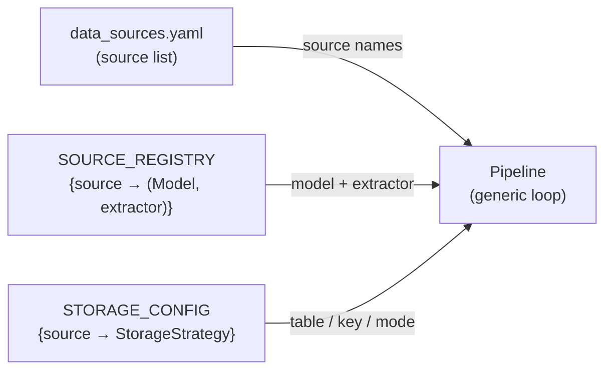

# ADR-004: Registry-Based Source Extensibility

## Context

The pipeline must ingest data from multiple external sources (Scryfall, MTGJson cards,
MTGJson prices). Each source has its own URL, file format, Pydantic model, and storage
strategy (table name, primary key, upsert vs full-replace, snapshot rules).

Two approaches were considered for wiring sources to their handlers:

**Option A — Hardcoded conditionals:** An `if source == "scryfall": ...` chain inside
the pipeline. Each new source requires editing pipeline logic.

**Option B — Registry pattern:** A mapping declared as a constant that associates each
source identifier with its model and extractor. Storage configuration is similarly
declared separately from pipeline logic.

## Decision

Use two registries declared as module-level constants:

- `SOURCE_REGISTRY` in `sources.py` — maps source type → `(Pydantic model, extractor function)`
- `STORAGE_CONFIG` in `storage/bronze/config.py` — maps source type → storage strategy
  (table name, primary key, incremental flag, snapshot definitions)

Adding a new data source requires only extending these two mappings and providing
a Pydantic model. No changes to pipeline orchestration logic are needed.

## Consequences

### Positive
- New sources are addable by configuration, not by branching logic.
- Source capabilities (model, extractor, storage strategy) are co-located and readable
  in one place rather than scattered across conditionals.
- Pipelines are source-agnostic: they iterate over registered sources generically.
- Easier to test each source in isolation via registry lookup.

### Negative
- Indirection: the link between a source name and its behaviour is implicit in the
  registry rather than explicit in a call chain.
- New sources still require a Pydantic model and extractor function — only the wiring
  is config-driven, not the implementation.

### Neutral
- The market integrations (`allegro.py`, `cardmarket.py`) are reserved module stubs,
  designed to be registered the same way once implemented.

## Diagram

## Alternatives Considered

| Approach | Reason rejected |
|---|---|
| Hardcoded conditionals | Every new source requires editing pipeline logic; sources are not independently testable |
| Plugin system (entry points) | Over-engineered for a single-process pipeline with a small, known set of sources |
| Class-per-source hierarchy | Inheritance adds complexity without benefit when sources differ only in data shape, not behaviour |
