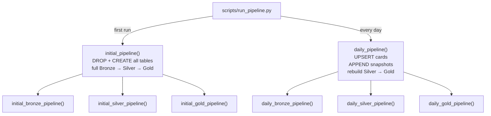

# ADR-005: Two-Phase Pipeline Lifecycle

## Context

The data pipeline has two meaningfully different operational modes:

1. **First run:** All tables are absent. Every source must be downloaded, every table
   created from scratch, and all downstream layers (Silver, Gold) fully rebuilt.
2. **Daily run:** Tables already exist. Only incremental changes (new cards, today's
   prices) need to be applied and daily snapshots appended.

Three approaches were considered:

**Option A — Single idempotent pipeline:** One function checks table existence and
decides per-table whether to create or upsert. Handles both modes transparently.

**Option B — Flag-controlled pipeline:** A single function with an `is_initial: bool`
flag that branches internally.

**Option C — Explicit split:** Two separate top-level functions (`initial_pipeline`,
`daily_pipeline`) with distinct implementations for each phase.

## Decision

Use **two explicit top-level functions**: `initial_pipeline()` and `daily_pipeline()`.

- `initial_pipeline` drops and recreates all tables. It accepts a `download` flag to
  control whether source files are re-fetched.
- `daily_pipeline` upserts card tables, appends snapshot rows, and rebuilds Silver/Gold
  incrementally.
- Both delegate to per-tier functions (`initial_bronze_pipeline`, `daily_bronze_pipeline`,
  etc.) which in turn delegate to the storage layer.

The entry point (`scripts/run_pipeline.py`) selects which phase to run.

## Consequences

### Positive
- Intent is unambiguous: calling `daily_pipeline` on an empty database is a clear
  programming error, not a silently degraded execution.
- Daily runs are faster — they skip DROP/CREATE overhead and avoid re-downloading
  hundreds of MB of JSON.
- Each phase can be tested independently with fixtures matching its preconditions.
- Recovery paths are explicit: if Bronze is corrupt, run `initial_pipeline(download=False)`
  to rebuild without re-downloading.

### Negative
- More code than a single idempotent function; some logic is duplicated between phases.
- Caller must choose the correct phase — there is no automatic detection of database state.

### Neutral
- `scripts/run_pipeline.py` currently defaults to `daily_pipeline`. Switching to `initial_pipeline`
  requires a code change rather than a CLI flag (a future CLI interface could expose this).

## Diagram

## Alternatives Considered

| Approach | Reason rejected |
|---|---|
| Single idempotent pipeline | Hides the operational difference; daily runs pay the full-load cost unnecessarily |
| Flag-controlled single function | Flag-controlled branching is harder to test and obscures intent — two clear functions are cleaner |
