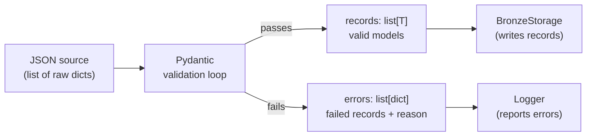

# ADR-006: Records and Errors as Co-returned Tuples

## Context

Ingesting large bulk JSON files (300k+ records per file) will always encounter some
invalid records — malformed entries, missing required fields, unexpected nulls from
API quirks. Two approaches were considered for handling these failures:

**Option A — Fail-fast:** Raise an exception on the first invalid record. The entire
ingest run is aborted.

**Option B — Partial success:** Collect invalid records separately and return them
alongside valid records. Processing continues for all remaining records.

## Decision

All ingest and validation functions return a **`(records, errors)` tuple** where:

- `records` is `list[T]` — successfully validated Pydantic model instances.
- `errors` is `list[dict]` — raw dicts of records that failed validation, with the
  validation error attached.

Invalid records are never silently dropped and never silently passed downstream.
The caller is always given both the usable data and a full account of what was rejected.

This pattern propagates through multiple layers: `load_source` returns it,
`ingesting_pipeline` returns it, and `BronzeStorage` reports errors from it.

## Consequences

### Positive
- A handful of malformed records (common with third-party APIs) do not abort a run
  that processes hundreds of thousands of valid records.
- Errors are always surfaced — logged and available for inspection — never silently
  discarded or coerced.
- Each layer's error handling can be independently inspected and tested.
- Re-running after an API schema change will surface exactly which records failed
  and why, without requiring a full re-download.

### Negative
- Callers must always handle or explicitly ignore the errors return value.
- Partial success can mask systematic failures if the error list is not monitored
  (e.g. an API breaking change that invalidates 90% of records would still "succeed").

### Neutral
- The pattern is symmetric with how Silver transformations report issues: a
  transformation report JSON is written per-run with counts of dropped rows,
  parse failures, and coercion warnings.

## Diagram

## Alternatives Considered

| Approach | Reason rejected |
|---|---|
| Fail-fast (raise on first error) | Aborts the entire run for one bad record; unusable for bulk third-party data |
| Silent drop | Invalid records disappear without trace; schema drift becomes invisible |
| Exception-per-record with retry | Excessive overhead; no benefit when the error is a schema mismatch not a transient failure |
