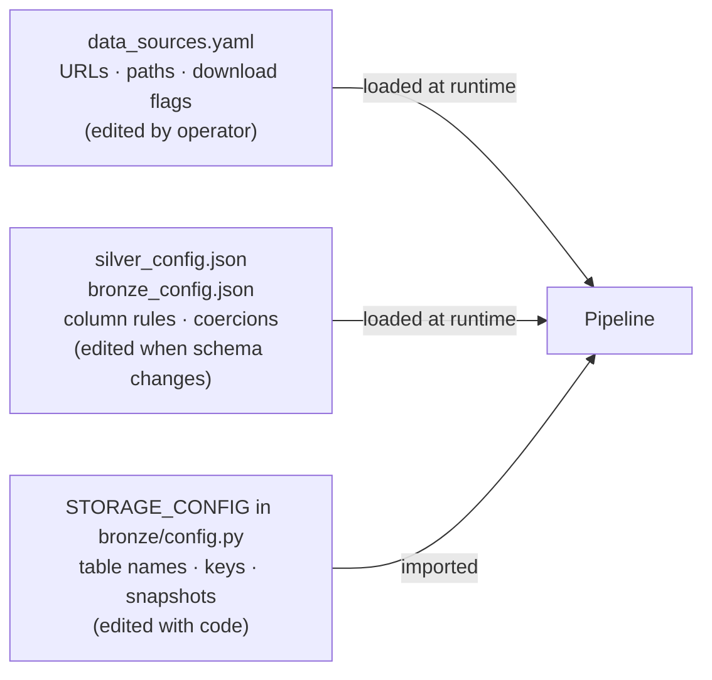

# ADR-007: Three-Level Configuration Hierarchy

## Context

The pipeline requires configuration at several distinct stability levels:

- **Ingest parameters** (source URLs, local file paths, download flags) change when
  APIs update endpoints or file names. These are edited frequently by operators.
- **Transformation rules** (which columns to drop, how to coerce types, which values
  to normalise) change when the data schema evolves or cleaning logic is refined.
- **Storage strategy** (table names, primary keys, upsert vs full-replace, snapshot
  column definitions) is tightly coupled to code and changes rarely.

Two alternatives were considered:

**Option A — Single config file:** One YAML or TOML file holds all configuration.
Simple but mixes concerns with different change rates into one file.

**Option B — Tiered config:** Each stability level uses the most appropriate format
and lives in a separate file.

## Decision

Adopt a **three-level hierarchy** matching format to change rate and coupling:

| Level | File | Format | Contains |
|---|---|---|---|
| Ingest | `configs/data_sources.yaml` | YAML | Source URLs, local paths, download flags |
| Transformation | `configs/silver_config.json`, `configs/bronze_config.json` | JSON | Column rules, type coercions, value normalisations |
| Storage | `STORAGE_CONFIG` constant in `storage/bronze/config.py` | Python | Table names, primary keys, snapshot definitions |

YAML is used for ingest parameters because it is human-friendly for frequently-edited
values. JSON is used for transformation rules because it is machine-readable and
can be version-controlled with clear diffs. Python constants are used for storage
strategy because they are tightly coupled to the storage class and type-checked by mypy.

## Consequences

### Positive
- Operators can update source URLs without touching Python code.
- Transformation rules are auditable in JSON diffs without reading Python.
- Storage strategy changes co-locate with the class that uses them, keeping the
  type system in control of correctness.
- Each level can be loaded and tested independently.

### Negative
- Three files to look at instead of one when diagnosing a pipeline issue.
- The split is a convention — there is nothing enforcing that storage config stays
  in Python or transformation rules stay in JSON.

### Neutral
- `gold_config.json` was originally reserved for when the Gold layer would be
  implemented. Gold shipped without ever needing transformation-rule config
  (its logic is pure SQL/window functions with no tunable parameters), so the
  placeholder was removed in 2026-07 rather than carried indefinitely.

## Diagram

## Alternatives Considered

| Approach | Reason rejected |
|---|---|
| Single YAML file | Mixes frequently-changed ingest URLs with rarely-changed storage strategy; diff noise |
| All configuration in Python | Non-technical operators cannot update source URLs without touching code |
| Environment variables | Suitable for secrets or deployment-specific values, not for structured transformation rules |
