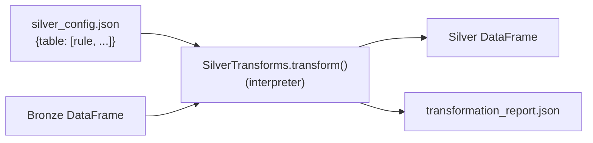

# ADR-008: Config-Driven Silver Transformations

## Context

The Silver layer must transform multiple Bronze tables (cards, prices, history) using
operations that are largely homogeneous: drop columns, coerce types, normalise strings,
fill nulls, rename columns. Each table requires a different combination of these
operations applied to different columns.

Two approaches were considered:

**Option A — Per-source Python functions:** A dedicated `transform_scryfall_cards()`,
`transform_mtgjson_cards()`, etc. Each function is free-form Python using pandas.

**Option B — Config-driven interpreter:** A single `_transform()` function that reads
a declarative rule set from `silver_config.json` and applies it generically.

## Decision

Use a **config-driven interpreter**: `silver_config.json` declares transformation rules
per table as structured data, and `SilverTransforms.transform()` interprets them.
`SilverTransforms` is instantiated once per pipeline run and called per source table
by `SilverStorage._pipeline()`.

The supported rule types, applied in a fixed sequence, are:

1. Row filtering — drop rows where `column == value`
2. Column dropping
3. JSON string parsing — deserialise embedded JSON strings back to lists/dicts
4. String cleaning — strip whitespace, case conversion, sentinel replacement (`_` → null)
5. Numeric coercion — `pd.to_numeric(..., errors="coerce")`
6. List normalisation — fill None with `[]`, apply per-item case transforms
7. Boolean filling — None → False
8. Value normalisation — expand language codes, normalise legality strings
9. Computed columns — errata detection, type-line parsing
10. Column renaming

All issues encountered during transformation (dropped rows, parse failures, coercion
warnings) are collected and written to a per-run JSON transformation report.

## Consequences

### Positive
- Transformation rules are auditable in JSON diffs without reading Python.
- Adding a new transformation for an existing table requires no code change.
- The sequence of operations is fixed and documented, so transformation order is
  predictable and not source-dependent.
- Idempotency is explicit: snapshots are only written once per `(key, snapshot_date)`.

### Negative
- The config-driven approach is limited to the rule types `_transform()` supports.
  Complex logic (e.g. multi-column derived features) requires extending the interpreter
  or falling back to a bespoke function.
- Debugging a transformation issue requires reading both the JSON config and the
  interpreter code to understand what ran.

### Neutral
- The transformation report provides a written audit trail of every transformation run,
  including counts of affected rows per operation.

## Diagram

## Alternatives Considered

| Approach | Reason rejected |
|---|---|
| Per-source Python functions | Transformations are scattered across many functions; adding a column drop to one source requires finding and editing its dedicated function |
| SQL-only transformations | Bronze STRUCT columns are awkward to flatten in pure SQL; pandas operations are clearer for the cleaning steps needed |
| dbt | Adds a separate tool and workflow for a single-process pipeline that doesn't need dbt's DAG orchestration |
