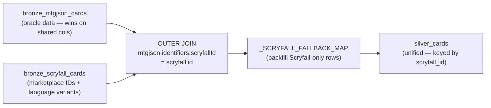

# ADR-009: MTGJson-Priority Card Join Strategy

## Context

The Silver layer unifies card data from two independent sources:

- **MTGJson** (`bronze_mtgjson_cards`): Comprehensive oracle and rules data — rulings,
  foreign language data, leadership skills, full legalities, identifiers for all
  platforms. Authoritative for card text and print details.
- **Scryfall** (`bronze_scryfall_cards`): Authoritative for marketplace and digital
  platform IDs — `arena_id`, `tcgplayer_id`, price data. Also carries image URIs
  and EDHREC rank. One record per unique printing **per language**, so Japanese,
  Italian, and other language variants appear as distinct rows.

Both sources cover the same physical cards, but neither is a superset of the other.
A join strategy must decide which source is primary and which fills gaps.

Three approaches were considered:

**Option A — Scryfall as primary:** Scryfall records are the base; MTGJson data is
appended for columns Scryfall lacks.

**Option B — MTGJson as primary (left join):** MTGJson records are the base; Scryfall
data fills in marketplace and digital IDs. Scryfall-only printings are dropped.

**Option C — Outer join with MTGJson priority:** Both sources contribute rows. MTGJson
wins on all overlapping columns for matched records. Scryfall-only rows (language
variants, promos, etc.) are included with MTGJson columns backfilled from Scryfall
where an equivalent field exists.

## Decision

Use an **outer join with MTGJson as the priority source** for all matched records.

- Join key: `mtgjson.identifiers.scryfallId = scryfall.id`
- MTGJson wins on all overlapping columns (card text, set details, legalities).
- Scryfall contributes: `arena_id`, `tcgplayer_id`, image URIs, `edhrec_rank`,
  `promo_types`, and price-related metadata not present in MTGJson.
- Scryfall-only rows (no MTGJson match) are included and have their MTGJson columns
  backfilled from Scryfall equivalents via `_SCRYFALL_FALLBACK_MAP`.
- A `has_mtgjson_data: bool` column marks which rows are fully enriched vs Scryfall-only.
- The primary key for `silver_cards` and `silver_prices_history` is `scryfall_id`
  (every row has one; MTGJson `uuid` is NULL for Scryfall-only rows).
- The result is written to `silver_cards` as the single unified card table.

This replaces the earlier left-join approach (Option B) which silently dropped
language variants. Japanese, Italian, and other non-English printings frequently
have distinct market prices and are now retained as separate rows.

## Consequences

### Positive
- All physical language variants (Japanese, Italian, etc.) are included in
  `silver_cards` and receive price data from `silver_prices_history`.
- Cards present in MTGJson but absent from Scryfall are still retained.
- Oracle data (rulings, foreign data, identifiers) still comes from the most
  authoritative source for matched rows.
- `has_mtgjson_data` lets downstream queries distinguish fully enriched rows from
  Scryfall-only rows and handle NULL MTGJson columns explicitly.

### Negative
- Scryfall-only rows have NULL in MTGJson-exclusive columns (`uuid`, `rulings`,
  `leadership_skills`, `types`/`supertypes`/`subtypes`, etc.).
- Row count grows significantly (~98K → ~500K+), increasing storage and query cost.
- Requires MTGJson and Scryfall downloads to be in sync; a lag between the two
  sources leaves some Scryfall columns null for newly added cards.

### Neutral
- `_SCRYFALL_FALLBACK_MAP` defines the explicit column-level mapping used to backfill
  Scryfall-only rows. Adding a new fallback requires only a new entry in the map.
- History tables (`bronze_scryfall_prices_history`, `bronze_mtgjson_prices_history`)
  remain separate sources joined in `_build_prices_history`.

## Diagram

## Alternatives Considered

| Approach | Reason rejected |
|---|---|
| Scryfall as primary | Omits cards MTGJson tracks that Scryfall does not; Scryfall is weaker on oracle/rules data |
| MTGJson left join (previous decision) | Drops language variants (Japanese, Italian, etc.) which have distinct prices |
| Symmetric merge with per-column precedence | More complex to maintain; the authority split (oracle → MTGJson, marketplace → Scryfall) is clear enough without symmetric logic |
