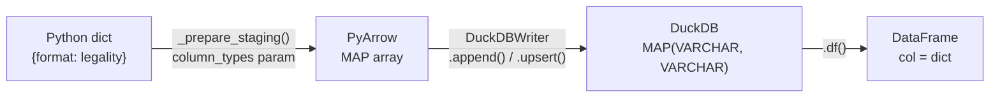

# ADR-021: DuckDB MAP Type for the `legalities` Column

## Context

The `legalities` field (from Scryfall and MTGJson) is a Python dict mapping format names
to legality strings, e.g.:

```python
{"standard": "legal", "modern": "not_legal", "commander": "legal"}
```

This field is written to the `legalities` column in `silver_meta_history` (and the DuckDB
silver tier in general). Two storage approaches were considered:

**Option A — JSON VARCHAR:** Serialize the dict to a JSON string before writing to DuckDB.
DuckDB stores `'{"standard": "legal", ...}'` as VARCHAR. Consumers must call
`json.loads()` to read it back into a Python dict.

**Option B — MAP(VARCHAR, VARCHAR):** Use PyArrow to convert the Python dict to a typed
MAP array before writing. DuckDB stores a native `MAP(VARCHAR, VARCHAR)` column.
Consumers read it as a Python dict directly without any parsing.

## Decision

Use **native MAP(VARCHAR, VARCHAR)** (Option B).

This is implemented via the `column_types` parameter added to `DuckDBWriter.full_load()`,
`upsert()`, and `append()` in `src/data/cards/storage/base.py`. When
`column_types={"legalities": "MAP(VARCHAR, VARCHAR)"}` is passed, `_prepare_staging()`
converts Python dicts to PyArrow MAP arrays before writing — bypassing the default JSON
serialization path.

## Consequences

### Positive
- SQL queries on `silver_meta_history.legalities` can use DuckDB's native MAP syntax:
  `legalities['standard']` instead of `json_extract_string(legalities, '$.standard')`.
- Type-safe: DuckDB enforces that keys and values are VARCHAR, not arbitrary JSON.
- `COUNT(DISTINCT legalities)` in SQL works correctly for legality transition detection
  (used in `GoldSignalBuilders._has_legality_transitions()`).
- No round-trip JSON parse overhead in Python consumers — the column is already a dict
  when loaded via `.df()`.

### Negative
- DuckDB MAP type is not directly compatible with `CAST(VARCHAR → MAP)` — conversion must
  be done at the PyArrow level via `_prepare_staging()`, not via SQL CAST. This adds a
  dependency on PyArrow for any write path that uses typed columns.
- Existing databases written before this decision have VARCHAR legalities. Consumers
  (`GoldSignalBuilders._load_and_parse_meta`) must handle both: `isinstance(x, str) →
  json.loads(x)` for old rows, `isinstance(x, dict)` for new rows.

## Diagram



## Alternatives Considered

| Approach | Reason not chosen |
|---|---|
| JSON VARCHAR | Consumers must call `json.loads()`; SQL queries are verbose (`json_extract_string`); `COUNT(DISTINCT legalities)` compares raw JSON strings which may differ by key ordering |
| DuckDB STRUCT | Requires a fixed schema — the set of valid formats can grow (e.g. a new format added by Scryfall); MAP is schema-flexible |
