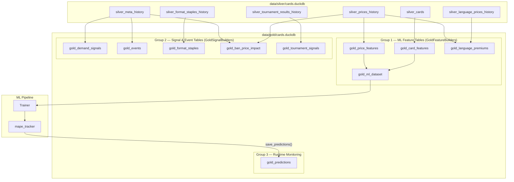

# ADR-022: Gold Layer Table Design

## Context

ADR-003 established the medallion architecture (Bronze → Silver → Gold). The Gold
layer's job is to materialise ML-ready feature tables from Silver data. As the project
grew, 9 Gold tables were implemented across two builders (`GoldFeatureBuilders` and
`GoldSignalBuilders`) and one runtime table (`gold_predictions`). ADR-003 only shows
`gold_card_features` and `gold_price_features` — the full Gold table set and their
roles in the ML pipeline are undocumented.

## Decision

The Gold layer is divided into three groups of tables.

### Group 1 — ML Feature Tables

Built by `GoldFeatureBuilders` in `src/data/cards/storage/gold/features.py`.

| Table | Source | Contents |
|---|---|---|
| `gold_card_features` | `silver_cards` | Static card metadata encoded for ML: rarity_ord (ordinal), mana_value, color_count, color_identity_count, format_count, is_legendary, is_commander_legal, is_modern_legal |
| `gold_price_features` | `silver_prices_history` | Per-card per-date price features: eur, lag_1d, lag_7d, lag_30d, pct_change_7d, rolling_mean_30d, rolling_std_30d, log_return_7d (the ML target), snapshot_date |
| `gold_language_premiums` | `silver_prices_history` + `silver_language_prices_history` | Non-English edition price premiums over the English baseline, per card and snapshot date |
| `gold_ml_dataset` | `gold_price_features` + `gold_card_features` | Full ML training frame: price features joined with card features; rows with NULL `log_return_7d` targets excluded. Only built when price history spans ≥ 7 days. |

### Group 2 — Signal and Event Tables

Built by `GoldSignalBuilders` in `src/data/cards/storage/gold/signals.py`.

| Table | Source | Contents |
|---|---|---|
| `gold_demand_signals` | `silver_meta_history` | Per-card per-date EDHREC rank deltas, ban/unban event flags — demand momentum proxies |
| `gold_events` | `silver_meta_history` | Format-level ban/unban event calendar: event_date, format, event_type, card_count |
| `gold_format_staples` | `silver_format_staples_history` | Per-card-format rolling deck-inclusion averages and momentum signals |
| `gold_ban_price_impact` | `silver_meta_history` + `silver_prices_history` | EUR price windows (30d before, 7d before, at event, 7d after, 30d after) for each ban/unban event |
| `gold_tournament_signals` | `silver_tournament_results_history` | Per-oracle_id-format top-8 appearance counts and copy averages over 30-day and 90-day windows |

### Group 3 — Runtime Monitoring Tables

Written by `src/monitoring/mape_tracker.py` at API time.

| Table | Written by | Contents |
|---|---|---|
| `gold_predictions` | `mape_tracker.save_predictions()` | Per-card per-date model predictions with model_run_id for lineage; used for MAPE auditing |

### Why a complete rebuild for every `update()` call

Gold features rely on window functions (rolling means, lag features) that span the full
price history. Adding a new day's data changes historical window values for all cards —
for example, `rolling_mean_30d` for yesterday's row shifts when a new snapshot is
appended. An incremental append would leave stale window values for old rows. Therefore
`GoldStorage._pipeline()` always performs a full DROP + CREATE OR REPLACE regardless of
the `update` flag.

### Why `gold_ml_dataset` is a separate table (not a view)

The join of `gold_price_features` × `gold_card_features` is computed once at pipeline
time and stored. This avoids re-running the join at model training time (which would
require the trainer to know the join logic) and makes the training frame a stable,
inspectable artifact.

## Consequences

### Positive
- Each Gold table has a single, clear responsibility — feature tables for ML, signal
  tables for monitoring, predictions table for MAPE tracking.
- `gold_predictions` captures model output in the same database as input features,
  enabling full lineage: alert → prediction date → model_run_id → training snapshot.
- `gold_ml_dataset` decouples the Trainer from raw Silver data — it reads one
  precomputed table, not a multi-join.

### Negative
- Full rebuild for both `populate()` and `update()` means longer pipeline runs as the
  price history grows.
- Nine tables means more surface area to validate — a bug in
  `GoldSignalBuilders.build_events()` leaves `gold_events` stale silently.

## Diagram

## Alternatives Considered

| Approach | Reason rejected |
|---|---|
| Materialise Gold as SQL views | Views recompute on every query; window functions over 80k × 500-day histories would make API startup and training intolerable |
| One flat `gold_ml_features` table | Mixing card features with price features with signal features into one table creates schema coupling; each signal can be rebuilt independently when its source Silver table changes |
| Keep `gold_ml_dataset` as a training-time join | The Trainer would need to replicate Silver join logic; any schema change in Silver would break training scripts silently |
