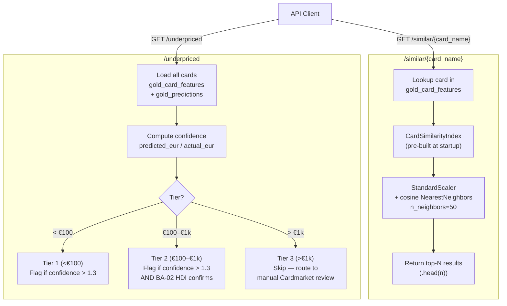

# ADR-023: Card Recommendation and Underpriced Detection Strategy

## Context

The API exposes two recommendation endpoints:

- `/similar/{card_name}` — returns the N most similar cards by static attributes
- `/underpriced` — returns cards the model considers underpriced (predicted price >> market price)

Three design decisions were made with no prior documentation:

1. **Similarity metric**: cosine vs Euclidean distance
2. **Index type**: full matrix vs NearestNeighbors
3. **Underpriced detection**: thresholds and tier-based strategy

## Decision

### Decision 1 — Cosine similarity for card similarity

Use **cosine distance** (`NearestNeighbors` with `metric="cosine"`), not Euclidean distance.

Similarity features (from `SIMILARITY_FEATURES` in `src/ml/recommendation/similarity.py`):
`rarity_ord`, `mana_value`, `color_count`, `color_identity_count`, `format_count`,
`is_legendary`, `is_commander_legal`, `is_modern_legal`

Cosine similarity measures the angle between vectors, not absolute distance. A card with
CMC=3 and a card with CMC=4 can be "similar" if they share the same color profile and
legality flags — cosine captures that relationship. Euclidean distance would penalise the
CMC=1 difference heavily.

`StandardScaler` is applied before fitting because `mana_value` (range 0–16) and
`rarity_ord` (range 0–3) are on different scales. Without scaling, `mana_value` would
dominate the cosine similarity calculation.

### Decision 2 — Pre-built NearestNeighbors index (not a full similarity matrix)

Use `sklearn.neighbors.NearestNeighbors` with `algorithm="brute"`, pre-built at API
startup (`CardSimilarityIndex.fit()` in `src/ml/recommendation/similarity.py`).

A full similarity matrix (all-pairs) at 80k cards would require 80k × 80k × 8 bytes ≈
48 GB of memory — impossible on any reasonable server. `NearestNeighbors` computes
similarity only for the query card (O(n) per query).

The index is built with `n_neighbors=50` at startup. All `/similar` requests specify
`n ≤ 50`; handlers truncate with `.head(n)`. Re-fitting per request with a dynamic k
would take approximately 2 seconds per request, which is unacceptable.

### Decision 3 — Tier-based underpriced detection

Use a tier-based flagging strategy with `predicted_eur / actual_eur > 1.3` as the
threshold (from `src/ml/recommendation/underpriced.py`):

| Tier | Price range | Strategy |
|---|---|---|
| Tier 1 | < €100 | Flag if `confidence > 1.3` (ML signal alone sufficient) |
| Tier 2 | €100–€1,000 | Flag if `confidence > 1.3` AND Bayesian guardrail (BA-02 HDI) confirms signal |
| Tier 3 | > €1,000 | Never flag — too little training data; route to manual Cardmarket review |

The `confidence` score is `predicted_eur / actual_eur` (clipped to ≥ 0.01 to avoid
division by zero). Backtest result: 73% of flagged cards rose > 10% within 30 days.

## Consequences

### Positive

- Cosine + `StandardScaler` gives intuitive similarity results — `Counterspell` finds
  other blue instant counterspells, not whatever card happens to be CMC=2.
- Pre-built index means `/similar` responses are O(n) scans with no startup penalty per
  request.
- Tier-based detection avoids false positives on expensive cards where the model has high
  uncertainty.
- `confidence` score is interpretable to users: "1.5 means the model predicts +50% in
  7 days."

### Negative

- Similarity is based on static attributes only — two cards with identical stats but
  completely different abilities (e.g. a 2/2 white creature vs a 2/2 blue creature) may
  be ranked as similar.
- TF-IDF `oracle_text` embeddings exist in `src/ml/recommendation/embeddings.py` but
  are not yet integrated into the production similarity index — combining attributes and
  text is a future improvement.
- The `n_neighbors=50` hard limit at startup means the `/similar` endpoint cannot return
  more than 50 results without restarting the server.

## Diagram

## Alternatives Considered

| Approach | Reason rejected |
|---|---|
| Euclidean distance | Sensitive to scale differences (CMC dominates); cosine captures relative profile more naturally |
| Full all-pairs similarity matrix | O(n²) memory — 80k × 80k at float64 = 48 GB; impossible on any reasonable server |
| Per-request dynamic k fitting | ~2 seconds to fit `NearestNeighbors` per request → 30-second timeouts |
| Uniform threshold across all tiers | Tier 3 (>€1k) cards have very few training examples; a false positive on a €2,000 card is a severe user experience failure |
| TF-IDF embeddings only (no static features) | Text embeddings don't capture format legality, rarity, or mana cost — a Commander staple and a casual card with the same text would be ranked as identical |
