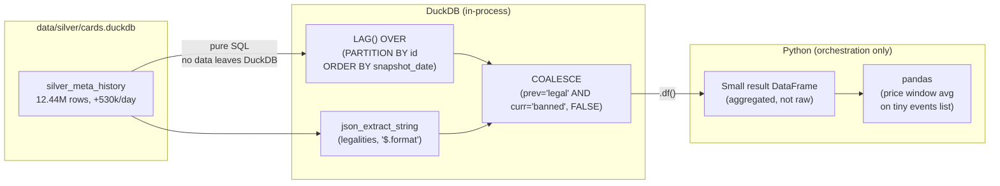

# ADR-024: DuckDB as the Compute Layer for Large History Queries

## Context

ADR-002 established DuckDB as the data store and showed a `DuckDB → pandas → ML`
pipeline, implying that pandas is the compute layer. For small datasets this is fine.
For the Gold signal builders reading `silver_meta_history` — which grows at ~530k rows/day
and reached 12.44M rows — it became a 78-minute bottleneck:

1. `_load_and_parse_meta()` executed `SELECT * FROM silver_meta_history` (12.44M rows
   pulled into Python).
2. `df["legalities"].apply(json.loads)` parsed every cell.
3. Five `df.groupby("id")["{fmt}_legality"].shift(1)` calls computed lagged legality per
   format.

DuckDB already has the primitives to express this entirely in-process:

- `json_extract_string(legalities, '$.commander')` — extracts a single format value from
  the JSON VARCHAR `legalities` column without loading data into Python.
- `LAG(...) OVER (PARTITION BY id ORDER BY snapshot_date)` — computes the previous-day
  value per card, replacing `groupby().shift(1)`.
- `COALESCE(prev = 'legal' AND curr = 'banned', FALSE)` — produces a boolean flag
  equivalent to the pandas comparison, with correct NULL handling (SQL `NULL AND NULL`
  is NULL, not FALSE — `COALESCE` maps it to FALSE to match the prior pandas behaviour).

Note on `legalities` storage format: `SilverStorage._pipeline()` writes
`silver_meta_history` using `DuckDBWriter.append()` without the `column_types` parameter.
The default path serialises Python dicts to **JSON VARCHAR strings** — not MAP type (as
described for the writer capability in ADR-021). `json_extract_string()` is therefore the
correct SQL accessor for this column.

## Decision

**DuckDB is the computation layer for queries over large Silver history tables. Python is
the orchestrator and I/O boundary only.**

Concretely:
- SQL window functions (`LAG`, `AVG OVER`, `STDDEV OVER`) replace `groupby().shift()` and
  `rolling()`.
- `json_extract_string()` replaces cell-by-cell `json.loads()` + `dict.get()`.
- Python receives a final, aggregated DataFrame — never the raw history table.
- Pandas remains acceptable for post-filter operations on small result sets (e.g. price
  window averaging over a handful of ban events).

All Gold builders must follow this pattern. `build_format_staples()`,
`build_tournament_signals()`, and `build_price_features()` already did. This ADR
makes the principle explicit and extends it to `build_demand_signals()`,
`build_events()`, and `build_ban_price_impact()`.

## Consequences

### Positive

- `gold_demand_signals` pipeline time: ~78 min → seconds (no 12.44M-row pandas load).
- All six `GoldSignalBuilders` methods are architecturally uniform — no special cases.
- `silver_meta_history` delta detection (previously considered to reduce table size) is
  unnecessary: Gold never pulls the full table into Python, so table size does not affect
  Python memory.
- A DuckDB `CHECKPOINT` after the largest Silver write (`silver_meta_history` append)
  distributes WAL flush across the session, eliminating the 10-minute silence at Silver
  pipeline close.

### Negative

- SQL window queries are harder to unit-test than pandas operations. Bugs (e.g. wrong
  PARTITION BY key, missing COALESCE) produce wrong data silently rather than raising
  an exception.
- Test fixtures must match the production storage format. `silver_meta_history.legalities`
  is VARCHAR JSON string — test DataFrames must use `json.dumps()`, not raw Python dicts,
  or `json_extract_string()` returns NULL in tests even when the logic is correct.

### Neutral

- `_has_legality_transitions()` (SQL pre-check) is unchanged — it already ran entirely
  in DuckDB and serves as the fast skip gate before the window-function query.

## Diagram

## Alternatives Considered

| Approach | Reason rejected |
|---|---|
| Keep pandas compute, reduce `silver_meta_history` size via delta detection | Adds schema complexity and write overhead. Root cause is pulling the full table into Python — removing that is simpler and more future-proof as the table keeps growing. |
| Move computation to Silver (`_parse_json_columns` already expands legalities) | Silver already expands legalities into scalar `is_{fmt}_legal` boolean columns for `silver_cards`. But `silver_meta_history` stores the raw JSON string for the daily history because the set of formats queried can change. Gold's SQL query selects only the formats it needs. |
| PySpark / Polars for large-frame compute | Adds a dependency and process boundary for a problem DuckDB already solves in-process. |

## Affected ADRs

- **ADR-002** — The `DuckDB → pandas → ML` diagram implies pandas is the compute layer.
  For small datasets this remains valid. For large Silver history tables, DuckDB is
  the compute layer; pandas receives only the aggregated result.
- **ADR-021** — Describes MAP(VARCHAR, VARCHAR) as the storage type for `legalities`.
  In practice, `silver_meta_history` is written without `column_types`, so `legalities`
  is VARCHAR JSON string. `json_extract_string()` (not `legalities['format']`) is the
  correct accessor.
