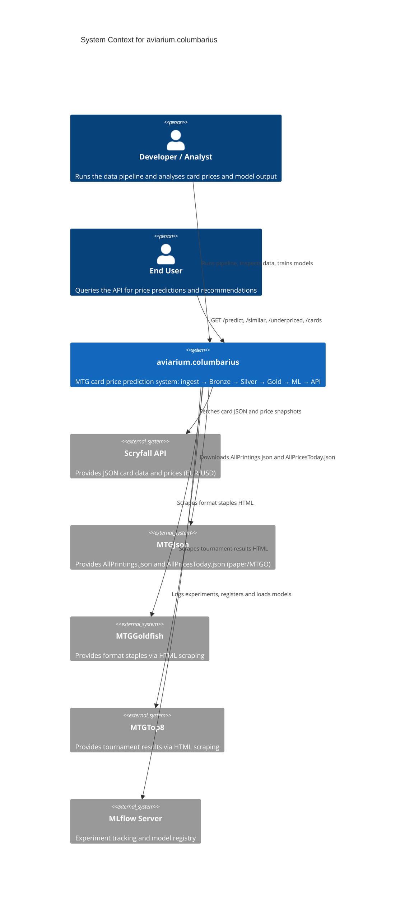

# C1 — System Context

This diagram shows the high-level system context for aviarium.columbarius, illustrating the external actors, data sources, and the central MTG card price prediction system and how they interact.

## Actors

**Developer / Analyst** — An engineer or data scientist who runs the data pipeline, inspects intermediate results, trains models, and analyzes card price trends and model outputs.

**End User** — External consumers of the system who query the REST API for card price predictions, recommendations for similar cards, underpriced opportunities, and card metadata.

## External Systems

**Scryfall API** — Primary source for Magic: The Gathering card metadata (names, mana costs, types, abilities) and price information in both EUR and USD currencies.

**MTGJson** — Alternative card database providing AllPrintings.json (comprehensive card catalog) and AllPricesToday.json for paper and Magic Online (MTGO) prices.

**MTGGoldfish** — External service providing current format-specific staples and competitive metagame information via HTML scraping.

**MTGTop8** — Tournament results and deck list database scraped to identify competitive trends and card performance metrics.

**MLflow Server** — Centralized experiment tracking, model versioning, and model registry. The system logs training runs, registers trained models, and loads models for inference during the API serving phase.

## Notes

- The system follows a multi-stage pipeline: **Ingest** → **Bronze** (raw data) → **Silver** (cleaned data) → **Gold** (enriched data) → **ML** (model training) → **API** (serving).
- Data flows inbound from external APIs and web sources, with processed data and artifacts flowing to MLflow for versioning and tracking.
- The Developer/Analyst is the primary pipeline operator, while End Users interact exclusively through the REST API.
- All external data sources (Scryfall, MTGJson, MTGGoldfish, MTGTop8) feed into the Bronze/Silver/Gold layers for consolidation and enrichment.
