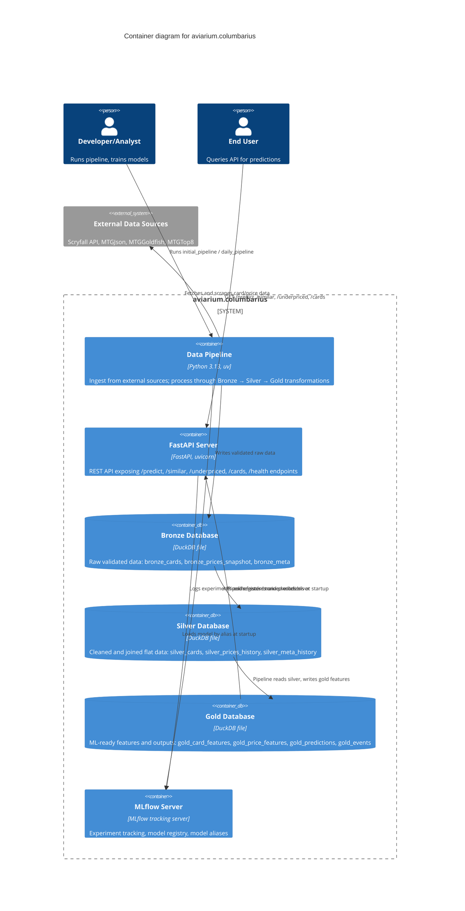

# C2 — Containers

The system decomposes into six core containers: a data pipeline for ETL, a FastAPI server for REST queries, and three DuckDB databases representing the Bronze-Silver-Gold data maturity model, plus MLflow for ML experiment tracking and model versioning.

## Containers

| Container | Technology | Purpose |
|---|---|---|
| **Data Pipeline** | Python 3.13, uv | Orchestrates ingest, validation, and multi-stage transformation; sources external APIs and processes raw data through Bronze/Silver/Gold stages; logs experiments to MLflow |
| **FastAPI Server** | FastAPI, uvicorn | Exposes REST API endpoints for prediction, similarity search, underpriced cards, and card metadata queries; loads ML models from MLflow at startup |
| **Bronze Database** | DuckDB file | Immutable raw data layer: bronze_cards, bronze_prices_snapshot, bronze_meta; serves as single source of truth for validated ingest |
| **Silver Database** | DuckDB file | Cleaned, normalized, and joined data layer; denormalizes bronze data into flat schemas for analytical use |
| **Gold Database** | DuckDB file | Feature-engineered and ML-ready layer; stores gold_card_features, gold_price_features, gold_predictions, and gold_events for model serving |
| **MLflow Server** | MLflow tracking server | Central registry for experiment runs, metrics, trained models, and model aliases; enables reproducibility and model governance |

## Data Flow

1. **Data Ingestion**: Developer/Analyst triggers the Data Pipeline, which fetches card/price data from external sources (Scryfall, MTGJson, MTGGoldfish, MTGTop8).

2. **Bronze Stage**: Validated raw data is written to the Bronze Database (bronze_cards, bronze_prices_snapshot, bronze_meta) as immutable historical record.

3. **Silver Stage**: The Data Pipeline reads from Bronze, applies cleaning and normalization, and writes joined flat tables to the Silver Database (silver_cards, silver_prices_history, silver_meta_history).

4. **Gold Stage**: The Data Pipeline reads from Silver, engineers features, and writes ML-ready data to the Gold Database (gold_card_features, gold_price_features) alongside predictions and events.

5. **Model Training**: The Data Pipeline logs experiment runs, metrics, and trained models to MLflow, registering models with aliases for easy promotion.

6. **API Serving**: At startup, the FastAPI Server loads the active model from MLflow and reads Gold Database tables (gold_card_features, gold_predictions). End Users query the API for predictions (/predict), similar cards (/similar), underpriced opportunities (/underpriced), and card metadata (/cards).
