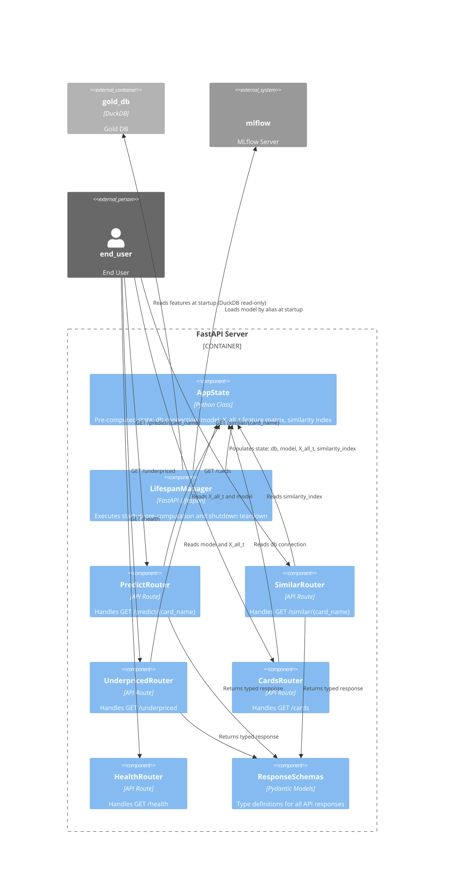

# C3 — FastAPI Server Components

This diagram shows the internal structure of the **FastAPI Server** container, depicting how individual components interact to serve prediction, similarity, underpriced card detection, and card lookup requests. The server uses startup pre-computation to load all required data (features, models, indexes) once at startup, then reuses them across all requests for performance (ADR-019).

## Components

| Component | Responsibility | Reference |
|---|---|---|
| **AppState** | Singleton class holding pre-computed data: database connection, loaded LightGBM model, X_all_t feature matrix, and CardSimilarityIndex. Shared across all request handlers. | ADR-019 |
| **LifespanManager** | FastAPI lifespan context manager that runs startup pre-computation (load features, model, build indexes) and graceful shutdown (close db, cleanup). | ADR-019 |
| **PredictRouter** | Handles `GET /predict/{card_name}` endpoint. Slices the card's features from X_all_t and calls the model to return price prediction. | |
| **SimilarRouter** | Handles `GET /similar/{card_name}` endpoint. Queries the CardSimilarityIndex to find semantically similar cards. | |
| **UnderpricedRouter** | Handles `GET /underpriced` endpoint. Scans market listings against the model to identify underpriced cards. Uses AppState model and feature matrix. | |
| **CardsRouter** | Handles `GET /cards` endpoint. Performs card name lookups against the gold_db. Uses AppState database connection. | |
| **HealthRouter** | Handles `GET /health` endpoint. Returns server status and model load confirmation. | |
| **ResponseSchemas** | Pydantic models defining response types for all API endpoints (prediction objects, similarity results, underpriced card lists, etc.). | |

## Startup Pre-computation

Pre-computing critical data at startup (ADR-019) eliminates redundant I/O and computation on every request:

- **Database Connection**: Opened once at startup, reused across all requests via AppState
- **Model Loading**: LightGBM model loaded from MLflow by alias at startup, held in memory
- **Feature Matrix (X_all_t)**: All card features pre-fetched from DuckDB and cached as a dense NumPy array for fast slicing
- **Similarity Index**: Pre-built CardSimilarityIndex for O(1) similarity lookups

This design trades startup latency for request-time throughput and consistency.
