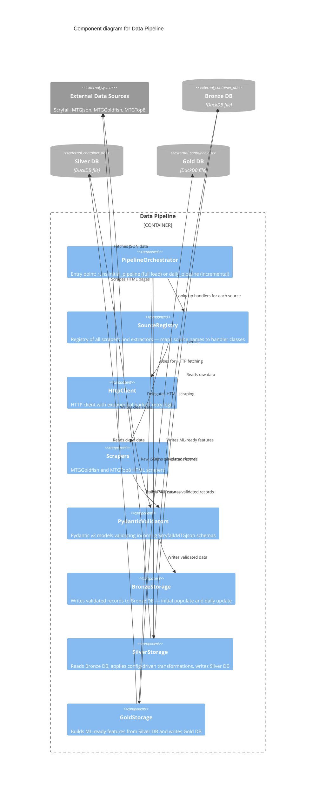

# C3 — Data Pipeline Components

The Data Pipeline container orchestrates the ingestion and transformation of Magic: The Gathering card data through three sequential storage layers: Bronze (raw), Silver (cleaned), and Gold (ML-ready). It coordinates multiple specialized components that handle data fetching from external sources, validation against Pydantic schemas, and layer-specific transformations driven by configuration.

## Components

| Component | Responsibility | ADR References |
|---|---|---|
| **PipelineOrchestrator** | Entry point orchestrating the full data pipeline execution; delegates to storage layer components for initial load or daily incremental updates | ADR-005 |
| **SourceRegistry** | Central registry mapping external source names to handler classes; abstracts scraper and extractor selection logic | ADR-004 |
| **HttpClient** | Handles all HTTP requests to external APIs with exponential backoff retry logic to manage rate limits and transient failures | ADR-014 |
| **Scrapers** | Specialized HTML parsers for MTGGoldfish and MTGTop8; extract structured data from web pages where APIs unavailable | (ADR-004 via SourceRegistry) |
| **PydanticValidators** | Validates incoming raw data against Pydantic v2 schemas for Scryfall, MTGJson, and custom formats; enforces data shape before persistence | ADR-001 |
| **BronzeStorage** | Persists validated records to Bronze layer; handles both initial full load and daily incremental updates from all external sources | ADR-005 |
| **SilverStorage** | Reads raw Bronze data, applies config-driven transformation rules, and writes cleaned, deduplicated records to Silver layer | ADR-008 |
| **GoldStorage** | Builds ML-ready feature sets from Silver layer data; computes derived columns and encodings required for model training | ADR-003 |

## Pipeline Modes

The PipelineOrchestrator supports two execution modes:

**initial_pipeline**: Performs a full load from all external sources, clearing previous Bronze/Silver/Gold data and rebuilding each layer from scratch. Used during setup or when full data refresh is required.

**daily_pipeline**: Incremental update mode that fetches only new or modified data from external sources since the last run, updates Bronze layer with incremental changes, and cascades transformations through Silver and Gold layers. Designed for efficiency and scheduled daily execution.
