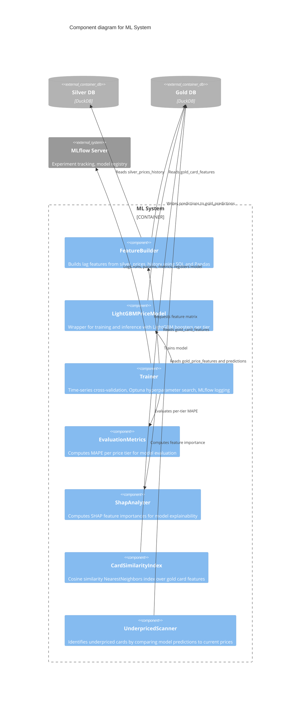

# C3 — ML System Components

The ML System subsystem orchestrates machine learning model training, inference preparation, and feature engineering for price prediction. It integrates with the Gold layer to build lag-based feature matrices, trains LightGBM price models per card tier using time-series cross-validation and Optuna hyperparameter search, computes SHAP explanations, and prepares similarity-based and rule-based card recommendation indices. All training artifacts (parameters, metrics, models) are logged to MLflow for experiment tracking and model registry.

## Components

| Component | Responsibility | Source Reference | ADR References |
|---|---|---|---|
| **FeatureBuilder** | Constructs lag-based feature matrices from silver price history; joins with card features to produce training-ready datasets | `src/ml/features/lag.py` | ADR-003 (medallion architecture), ADR-008 (Silver layer) |
| **LightGBMPriceModel** | Encapsulates LightGBM booster training and inference; maintains separate models per price tier; handles model serialization and loading | `src/ml/models/lightgbm_*.py` | ADR-017 (LightGBM model choice), ADR-018 (tier-based selection) |
| **Trainer** | Orchestrates the full training pipeline: feature generation, Optuna hyperparameter search, time-series cross-validation, metric evaluation, and MLflow logging | `src/ml/trainer.py` | ADR-017, ADR-018, ADR-019 (startup precomputation) |
| **EvaluationMetrics** | Computes MAPE (Mean Absolute Percentage Error) per price tier to measure model performance across different card value ranges | `src/ml/metrics/` | ADR-018 (tier-specific metrics) |
| **ShapAnalyzer** | Generates SHAP values for model features to provide explainability on which factors drive price predictions | `src/ml/explainability/` | ADR-020 (monitoring and retraining) |
| **CardSimilarityIndex** | Builds and maintains a KNeighborsIndex (cosine similarity) over Gold layer card features for recommendation and content-based filtering | `src/ml/indices/similarity.py` | ADR-019 (FastAPI startup precomputation) |
| **UnderpricedScanner** | Scans Gold layer predictions and current market prices to identify cards with significant upside potential (model prediction > current price) | `src/ml/indices/underpriced.py` | ADR-019, ADR-020 |

## Training Pipeline

The training pipeline runs when a Trainer instance is initialized or explicitly triggered:

1. **FeatureBuilder** reads `silver_prices_history` and `gold_card_features` to construct a feature matrix with lagged price indicators and card metadata.
2. **Trainer** splits the data using time-series cross-validation (respecting temporal order) and runs Optuna hyperparameter search to find optimal booster configurations per price tier.
3. For each tier, **LightGBMPriceModel** trains a booster on the train fold.
4. **EvaluationMetrics** computes per-tier MAPE on the validation fold.
5. **ShapAnalyzer** computes feature importance from the best model configuration.
6. **Trainer** logs all runs, hyperparameters, metrics, and the final models to the **MLflow Server** for experiment tracking and model registry.

The trained models are persisted to disk and loaded during API startup for inference preparation.

## Inference Preparation

At API startup (ADR-019), the system precomputes inference-time indices to support fast recommendation and anomaly detection:

1. **CardSimilarityIndex** loads `gold_card_features` and builds a KNeighborsIndex using cosine similarity, enabling fast lookups of similar cards by feature distance.
2. **UnderpricedScanner** reads the latest `gold_card_features` alongside the pre-trained **LightGBMPriceModel** predictions and identifies cards where the model's predicted price exceeds the current market price by a configurable threshold—these cards are candidates for investment recommendation.

Both indices are kept in-memory during the API lifecycle to support low-latency responses on pricing and recommendation endpoints.
