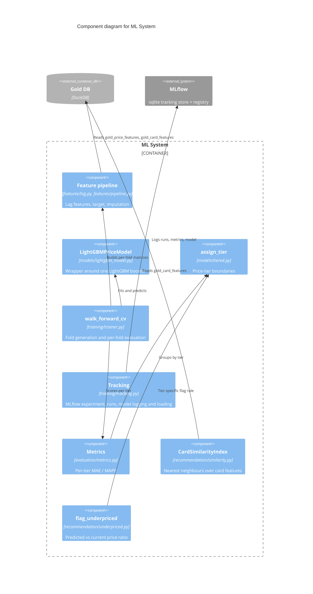

# C3 — ML System Components

The ML system turns the Gold layer into a trained price model and the inputs the API needs at request time. It builds lag features from `gold_price_features`, trains a single LightGBM model on the 7-day log-return target, evaluates it per price tier with walk-forward cross-validation, and logs runs and the model to MLflow. At API startup the same feature code builds the inference matrix and a card-similarity index.

*Revised 2026-09-29 against the code: the previous version cited modules that do not exist (`src/ml/trainer.py`, `src/ml/metrics/`, `src/ml/indices/`), placed Optuna inside the training pipeline, and had the model writing to `gold_predictions`, which nothing does.* <!-- doc-paths: historical -->

```mermaid
C4Component
  title Component diagram for ML System

  ContainerDb_Ext(gold_db, "Gold DB", "DuckDB")
  System_Ext(mlflow, "MLflow", "sqlite tracking store + registry")

  Container_Boundary(ml, "ML System") {
    Component(features, "Feature pipeline", "features/lag.py, features/pipeline.py", "Lag features, target, imputation")
    Component(model, "LightGBMPriceModel", "models/lightgbm_model.py", "Wrapper around one LightGBM booster")
    Component(tiers, "assign_tier", "models/tiered.py", "Price-tier boundaries")
    Component(trainer, "walk_forward_cv", "training/trainer.py", "Fold generation and per-fold evaluation")
    Component(tracking, "Tracking", "training/tracking.py", "MLflow experiment, runs, model logging and loading")
    Component(metrics, "Metrics", "evaluation/metrics.py", "Per-tier MAE / MAPE")
    Component(similarity, "CardSimilarityIndex", "recommendation/similarity.py", "Nearest neighbours over card features")
    Component(underpriced, "flag_underpriced", "recommendation/underpriced.py", "Predicted vs current price ratio")
  }

  Rel(features, gold_db, "Reads gold_price_features, gold_card_features")
  Rel(trainer, features, "Builds per-fold matrices")
  Rel(trainer, model, "Fits and predicts")
  Rel(trainer, metrics, "Scores per tier")
  Rel(metrics, tiers, "Groups by tier")
  Rel(tracking, mlflow, "Logs runs, metrics, model")
  Rel(similarity, gold_db, "Reads gold_card_features")
  Rel(underpriced, tiers, "Tier-specific flag rule")
```

## Components

| Component | Responsibility | Source | ADRs |
|---|---|---|---|
| **Feature pipeline** | Lag and rolling features per snapshot (SQL), the 7-day `log_return_7d` target, card attributes, and the sklearn imputation pipeline shared by training and serving | `src/ml/features/lag.py`, `src/ml/features/pipeline.py`, `src/ml/features/sql/` | ADR-022, ADR-024 |
| **LightGBMPriceModel** | Fits one LightGBM booster with early stopping; predicts `log_return_7d` | `src/ml/models/lightgbm_model.py` | ADR-017 |
| **Tiers** | `assign_tier` maps a current EUR price to tier 1/2/3 — the single source of the €100 / €1,000 boundaries. `TieredRouter` (separate Tier 1/2 models) exists but is used only in tests | `src/ml/models/tiered.py` | ADR-018 (amended) |
| **Baselines** | Naive, mean, MA7d and AR(1) forecasts for comparison | `src/ml/models/baseline.py` | — |
| **walk_forward_cv** | Generates expanding-window folds, keeps only folds with a validation snapshot and its t+7 partner, trains and scores each fold | `src/ml/training/trainer.py` | ADR-018 |
| **Tracking** | MLflow experiment setup (anchored to the project root), run logging, `cv_mape_tier1`, model logging and loading | `src/ml/training/tracking.py` | ADR-026 |
| **Metrics** | Per-tier MAE and MAPE on the log-return scale; no global aggregate | `src/ml/evaluation/metrics.py`, `src/ml/evaluation/error_analysis.py` | ADR-018 |
| **SHAP / Optuna** | TreeSHAP explanations and an Optuna search; used from notebook `ml_models/04`, not by the training pipeline | `src/ml/evaluation/shap_analysis.py` | ADR-028 |
| **CardSimilarityIndex** | Scaled card features + nearest-neighbour index for `/similar` | `src/ml/recommendation/similarity.py` | ADR-023 |
| **flag_underpriced** | Flags Tier 1/2 cards whose predicted price exceeds the current one by the confidence threshold | `src/ml/recommendation/underpriced.py` | ADR-023 |

## Training pipeline

Entry points: `scripts/train_model.py` (manual) and `scripts/check_and_retrain.py` (scheduled, only when a trigger fires). Both call `retrain()` in `src/monitoring/retraining.py`:

1. **walk_forward_cv** runs over the Gold history. With fewer than 3 usable folds it raises `InsufficientDataError`; `retrain()` then logs a warning and continues without CV.
2. The feature pipeline builds the matrix for the latest snapshot that has a t+7 target, drops rows with a NULL target, and fits the imputation pipeline.
3. **LightGBMPriceModel** trains one model on all tiers.
4. **Tracking** logs CV results (including `cv_mape_tier1`) and the model to a new MLflow run.
5. `_compare_and_promote` moves the registry's `production` alias only when both the new and the current model have a finite `cv_mape_tier1` and the new one is not worse (runbook §4c).

The API does not follow the alias: it loads the run named by `MODEL_RUN_ID`. `src/monitoring/serving_check.py` alerts when the two disagree.

## Inference preparation

At API startup (ADR-019) `app/main.py`:

1. builds the inference feature matrix for the latest Gold snapshot with the same feature pipeline and fits the imputation pipeline on it;
2. loads the model for `MODEL_RUN_ID` from MLflow (degraded mode if this fails);
3. builds the **CardSimilarityIndex**.

`/predict` answers from the precomputed matrix. `/underpriced` runs inference over the whole matrix on each request and applies **flag_underpriced**. Nothing is written back to Gold.
