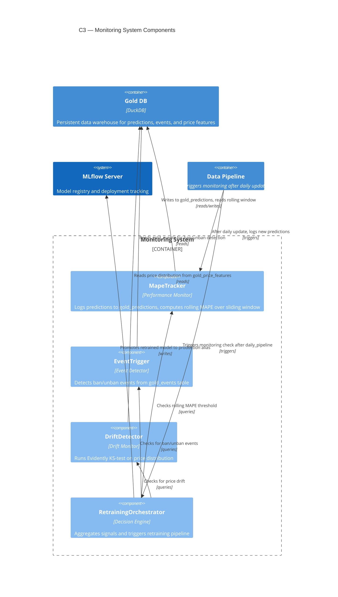

# C3 — Monitoring Components

The Monitoring subsystem continuously tracks model performance through three independent signals: prediction accuracy (MAPE), data drift detection, and business events. These signals feed into the RetrainingOrchestrator, which decides when to retrain and promote updated models to production.

## Components

| Component | Responsibility | ADR |
|-----------|---|---|
| **MapeTracker** | Logs predictions from the data pipeline to `gold_predictions` table and computes rolling MAPE over a sliding window to track prediction accuracy decay | [ADR-020](../../adr/020-model-retraining-strategy.md) |
| **EventTrigger** | Monitors the `gold_events` table for ban/unban events that signal market disruptions requiring model retraining | [ADR-020](../../adr/020-model-retraining-strategy.md) |
| **DriftDetector** | Runs Evidently statistical tests (KS-test) on the price feature distribution in `gold_price_features` to detect data drift | [ADR-020](../../adr/020-model-retraining-strategy.md) |
| **RetrainingOrchestrator** | Aggregates signals from the three monitors, evaluates the `should_retrain` decision logic, orchestrates the retraining pipeline, and promotes successful models in MLflow | [ADR-020](../../adr/020-model-retraining-strategy.md) |

## Retraining Decision Logic

The `should_retrain` signal is triggered when **any one** of the three monitors indicates a problem:

- **MAPE Threshold**: Rolling MAPE exceeds configured threshold (model accuracy degraded)
- **Event Signal**: Ban/unban event detected in `gold_events` (market disruption)
- **Drift Signal**: Evidently KS-test p-value indicates statistical drift in price distribution

When `should_retrain == True`, the RetrainingOrchestrator:
1. Signals the data pipeline to prepare fresh training data
2. Waits for the retraining job to complete
3. Evaluates the new model against holdout performance thresholds
4. If performance is acceptable, promotes the model to the production alias in MLflow
5. Logs the decision and metrics back to `gold_events` for audit trail
