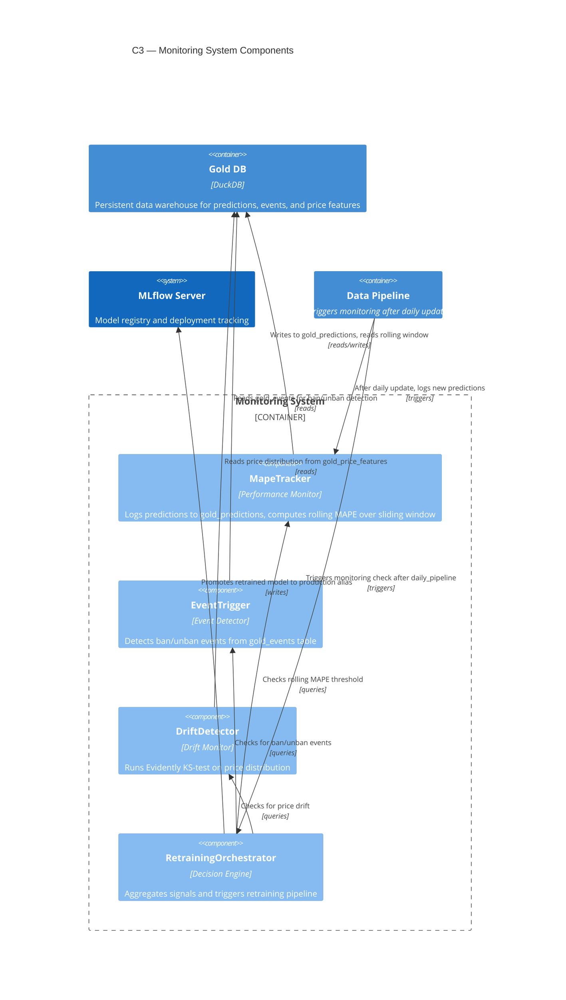

# C3 — Monitoring Components

The Monitoring subsystem tracks model performance through two signals that feed the retraining decision — prediction accuracy (MAPE) and business events (bans/unbans) — plus a third, data-drift signal that is computed and logged but **not currently wired into that decision** (ADR-020 explicitly defers this; the infrastructure exists for future integration). These signals feed into the RetrainingOrchestrator (`should_retrain` / `retrain` in `src/monitoring/retraining.py`), which decides when to retrain and promote updated models to production.

## Components

| Component | Responsibility | ADR |
|-----------|---|---|
| **MapeTracker** | Logs predictions from the data pipeline to `gold_predictions` table and computes rolling MAPE over a sliding window to track prediction accuracy decay | [ADR-020](../../adr/ADR-020-monitoring-and-retraining-architecture.md) |
| **EventTrigger** | Monitors the `gold_events` table for ban/unban events that signal market disruptions requiring model retraining | [ADR-020](../../adr/ADR-020-monitoring-and-retraining-architecture.md) |
| **DriftDetector** | Runs Evidently statistical tests (KS-test) on the price feature distribution in `gold_price_features` to detect data drift. Logged as a leading indicator; **not currently consumed by `should_retrain`** — see ADR-020's "Why Evidently for Drift Detection" section. | [ADR-020](../../adr/ADR-020-monitoring-and-retraining-architecture.md) |
| **RetrainingOrchestrator** | Aggregates signals from the three monitors, evaluates the `should_retrain` decision logic, orchestrates the retraining pipeline, and promotes successful models in MLflow | [ADR-020](../../adr/ADR-020-monitoring-and-retraining-architecture.md) |

## Retraining Decision Logic

`should_retrain` is triggered when **either** of two signals indicates a problem (checked in this order — event first, since it's the immediate trigger; MAPE as the fallback for gradual drift):

- **Event Signal**: Ban/unban event detected in `gold_events` on the same day (market disruption) — immediate trigger.
- **MAPE Threshold**: Rolling MAPE exceeds the configured threshold for 3 consecutive days (model accuracy degraded).

The **Drift Signal** (Evidently KS-test on the price distribution) is computed and logged for ops review but does **not** currently participate in this decision — see ADR-020.

When `should_retrain == True`, `scripts/check_and_retrain.py` (run on a daily schedule, per README's "Monitoring & Scheduled Retraining") orchestrates:
1. Retrains on the latest trainable Gold snapshot.
2. Evaluates the new model against holdout performance thresholds.
3. If performance is acceptable, promotes the model to the `production` alias in MLflow.
4. Writes the outcome to `logs/last_check_status.json` and, on any error branch, calls `src.monitoring.alerts.send_alert` (ADR-031) — durable JSONL log, best-effort desktop notification, and an optional webhook if `ALERT_WEBHOOK_URL` is configured.
5. Pings `HEARTBEAT_URL` (ADR-031) on every run, success or failure — a dead-man's-switch so a scheduled task that silently stops running at all (not just one that errors) is itself detectable.
