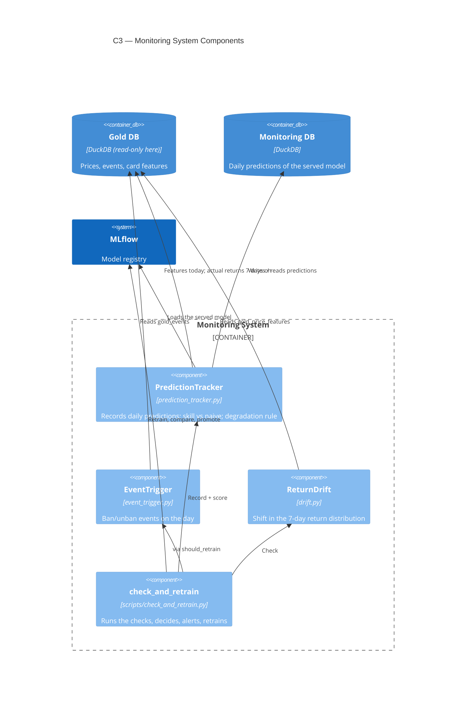

# C3 — Monitoring Components

The monitoring subsystem answers two questions every day ([ADR-034](../../adr/ADR-034-skill-vs-naive-and-return-drift-monitoring.md)): *is the served model still better than predicting "no change"?* and *has the way prices move shifted?* The first, together with ban/unban events, can trigger a retrain. The second only alerts. Everything runs from `scripts/check_and_retrain.py`, scheduled after the daily ETL.

*Revised 2026-09-30: the previous version described the MAPE tracker and Evidently drift report of [ADR-020](../../adr/ADR-020-monitoring-and-retraining-architecture.md), which never ran in production.*

```mermaid
C4Component
  title C3 — Monitoring System Components

  ContainerDb(gold_db, "Gold DB", "DuckDB (read-only here)", "Prices, events, card features")
  ContainerDb(mon_db, "Monitoring DB", "DuckDB", "Daily predictions of the served model")
  System(mlflow, "MLflow", "Model registry")

  Container_Boundary(monitoring, "Monitoring System") {
    Component(tracker, "PredictionTracker", "prediction_tracker.py", "Records daily predictions; skill vs naive; degradation rule")
    Component(event_trigger, "EventTrigger", "event_trigger.py", "Ban/unban events on the day")
    Component(drift, "ReturnDrift", "drift.py", "Shift in the 7-day return distribution")
    Component(orchestrator, "check_and_retrain", "scripts/check_and_retrain.py", "Runs the checks, decides, alerts, retrains")
  }

  Rel(tracker, mlflow, "Loads the served model")
  Rel(tracker, gold_db, "Features today; actual returns 7 days on")
  Rel(tracker, mon_db, "Writes / reads predictions")
  Rel(event_trigger, gold_db, "Reads gold_events")
  Rel(drift, gold_db, "Reads gold_price_features")
  Rel(orchestrator, tracker, "Record + score")
  Rel(orchestrator, drift, "Check")
  Rel(orchestrator, event_trigger, "via should_retrain")
  Rel(orchestrator, mlflow, "Retrain, compare, promote")
```

## Components

| Component | Responsibility | ADR |
|---|---|---|
| **PredictionTracker** | Scores every card on the latest Gold snapshot with the served model (the API's feature path) and stores the predicted 7-day log return. Once actuals exist, computes per date `skill = 1 − MAE(model)/MAE(naive)` on Tier 1 cards; `is_degraded` is true when the last 3 evaluated dates are all below −5%. | [ADR-034](../../adr/ADR-034-skill-vs-naive-and-return-drift-monitoring.md) |
| **EventTrigger** | Detects ban/unban events in `gold_events` on the day of the run. | [ADR-020](../../adr/ADR-020-monitoring-and-retraining-architecture.md) |
| **ReturnDrift** | Compares the latest week of matured 7-day returns with the four weeks before it: Wasserstein distance normalised by the reference spread, threshold 0.15. Alert only. | [ADR-034](../../adr/ADR-034-skill-vs-naive-and-return-drift-monitoring.md) |
| **check_and_retrain** | Runs the above, alerts on degradation, drift or a failed step, calls `should_retrain` (ban first, then degradation), retrains and lets `_compare_and_promote` decide on promotion. | [ADR-020](../../adr/ADR-020-monitoring-and-retraining-architecture.md), [ADR-031](../../adr/ADR-031-remote-alerting-channels.md) |

## Daily run

1. Record today's predictions of the served model (`MODEL_RUN_ID`, else the `production` alias) in the monitoring DB.
2. Score every prediction date whose t+7 prices have arrived; alert "Model worse than naive" when degraded.
3. Check return drift; alert "Price-return drift" when it exceeds the threshold.
4. `should_retrain`: a ban/unban event today, or step 2's degradation, triggers `retrain()` on the latest trainable snapshot; promotion needs a finite, not-worse `cv_mape_tier1`.
5. Write `logs/last_check_status.json` (including a `monitoring` summary) and ping `HEARTBEAT_URL`.

A failure in steps 1–3 is logged, alerted and listed under `monitoring.errors` in the status file. It never stops steps 4–5.
