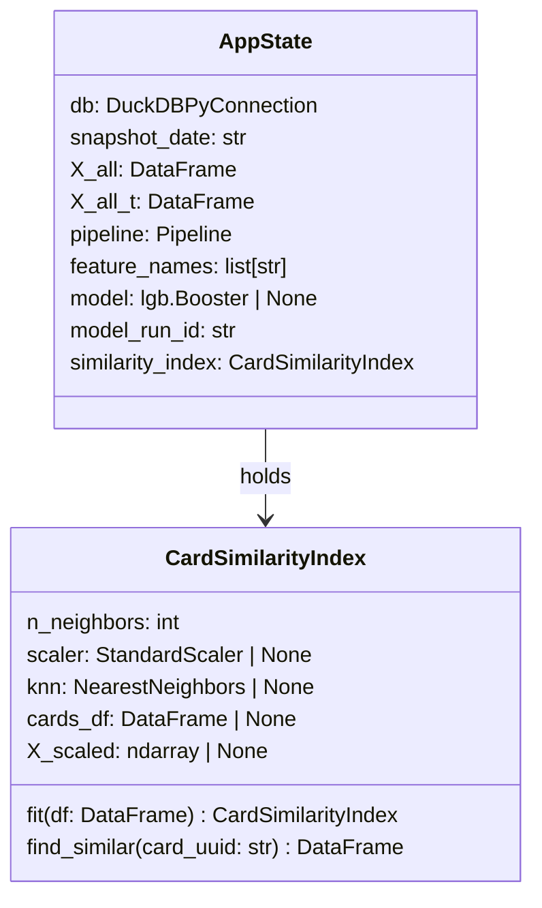

# C4 — API State & Startup Code

The API state container holds all runtime dependencies initialized during FastAPI startup: database connections, feature matrices, the fitted ML pipeline, the trained model, and a pre-built similarity index for card recommendations. This state is immutable after startup and accessed by all request handlers via dependency injection.

## AppState Attributes

| Attribute | Type | Description |
|-----------|------|-------------|
| `db` | `DuckDBPyConnection` | Read-only connection to the gold database. Used for schema lookups and validation. |
| `snapshot_date` | `str` | ISO date (YYYY-MM-DD) of the latest price snapshot in the database. Used for metadata in API responses. |
| `X_all` | `DataFrame` | Raw feature matrix for all cards before pipeline transformation. Dimensions: (n_cards, n_raw_features). |
| `X_all_t` | `DataFrame` | Pre-transformed feature matrix after fitting the sklearn pipeline. Dimensions: (n_cards, n_pipeline_features). Used for similarity index construction and model inference. |
| `pipeline` | `Pipeline` | Fitted sklearn Pipeline (imputer + scaler). Transforms raw features to model input space. Reused for all inference requests. |
| `feature_names` | `list[str]` | Column names of `X_all_t`. Used to map feature indices back to interpretable names in SHAP explanations. |
| `model` | `lgb.Booster \| None` | Loaded LightGBM booster for price prediction. `None` in degraded mode if `MODEL_RUN_ID` environment variable is unset. |
| `model_run_id` | `str` | MLflow run ID of the loaded model. Used for audit trails and model versioning. |
| `similarity_index` | `CardSimilarityIndex` | Pre-fitted cosine similarity index over `X_all_t`. Enables fast nearest-neighbor lookups for card recommendations. |

## Startup Sequence

The `lifespan(app: FastAPI)` async context manager in `app/main.py` performs the following initialization steps at API startup:

1. **Connect to DuckDB** — Opens a read-only connection to the gold database and stores it in `app.state.db`.
2. **Determine snapshot date** — Queries the database to find the latest price snapshot date and stores it in `app.state.snapshot_date`.
3. **Build raw feature matrix** — Calls `build_inference_features()` to construct `X_all` from gold_card_features for all cards in the database.
4. **Fit the pipeline** — Applies sklearn Pipeline (imputer + scaler) to `X_all`, producing `X_all_t` and storing the fitted `pipeline` and `feature_names` in state.
5. **Load LightGBM model** — Attempts to load the model from MLflow using the `MODEL_RUN_ID` environment variable. If unset, `model` is set to `None` (degraded mode).
6. **Build similarity index** — Instantiates `CardSimilarityIndex(n_neighbors=50)`, fits it on `X_all`, and stores it in `app.state.similarity_index` for fast recommendation queries.

## Degraded Mode

If the `MODEL_RUN_ID` environment variable is not set, step 5 skips model loading and `app.state.model` is initialized to `None`. In degraded mode:

- `/predict` and `/underpriced` endpoints return HTTP 503 (Service Unavailable) with a message indicating the model is not available.
- `/health` endpoint reports `model_available: false` but continues to return 200 OK.
- `/similar` endpoint continues to function normally using the pre-built `CardSimilarityIndex`.

This allows the API to remain partially operational for similarity-based features while blocking inference-dependent operations.
