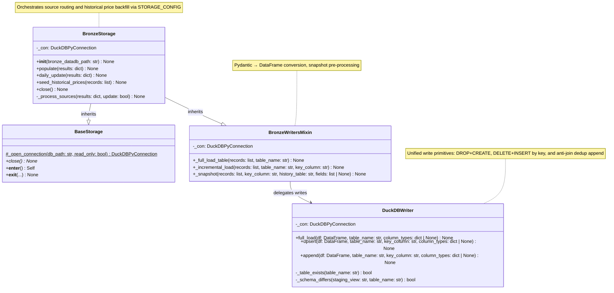

# C4 — BronzeStorage Code

BronzeStorage coordinates persistence of raw card ingestion data into DuckDB. It orchestrates source-to-table routing via STORAGE_CONFIG and provides three write patterns (full_load, upsert, append) that abstract DuckDB complexity from higher layers.

## Class Responsibilities

| Class | Responsibility |
|-------|-----------------|
| **DuckDBWriter** | Provide three low-level write patterns (full_load, upsert, append) that handle PyArrow type casting, staging table registration, and DuckDB error translation. |
| **BronzeWritersMixin** | Convert Pydantic records to DataFrames and perform snapshot preprocessing (field selection, snapshot_date injection) before delegating to DuckDBWriter. |
| **BronzeStorage** | Orchestrate source-to-table routing via STORAGE_CONFIG, manage the DuckDB connection lifecycle, and perform one-time historical price backfill. |
| **BaseStorage** | Provide static connection opening, context-manager protocol, and error translation for StorageConnectionError. |

## Write Patterns

**full_load** — `DROP TABLE IF EXISTS` + `CREATE TABLE` (initial populate or full rebuild)
- Used when source is not yet in the database or a complete rebuild is required
- Intended for initial BronzeStorage.populate() calls
- Delegates to DuckDBWriter.full_load()

**upsert** — `DELETE FROM table WHERE key IN (SELECT key FROM staging)` + `INSERT INTO table`
- Used for daily updates when current-state tables should replace rows
- Sources marked `incremental=True` in STORAGE_CONFIG use this pattern in daily_update mode
- Allows schema evolution without migration steps (new/removed columns are handled)
- Delegates to DuckDBWriter.upsert()

**append** — `LEFT JOIN anti-join` to `INSERT INTO table`
- Used for history/snapshot tables that must accumulate rows and never lose data
- Deduplicates via LEFT JOIN on (key_column, snapshot_date) so identical snapshots are skipped
- Multiple calls per day are idempotent
- Delegates to DuckDBWriter.append()
