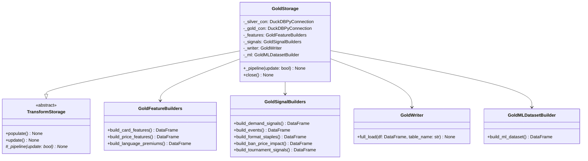

# C4 — GoldStorage Code

GoldStorage orchestrates the transformation of Silver layer data into Gold layer features, signals, and ML datasets. It uses specialized builders to construct card features, price features, demand signals, ban/format events, and the final ML training frame with t+7 price targets.

## Class Responsibilities

| Class | Responsibility |
|-------|-----------------|
| **TransformStorage** | Abstract base defining populate/update contract; subclasses implement _pipeline for specific data layers |
| **GoldStorage** | Orchestrates full Silver→Gold transformation: manages connections, coordinates builders, calls writers |
| **GoldFeatureBuilders** | Constructs card and price features with lag/window transformations from Silver |
| **GoldSignalBuilders** | Builds event and demand signals: bans, tournaments, format staples, demand indicators |
| **GoldMLDatasetBuilder** | Joins features and signals into final ML training frame with t+7 price targets |
| **GoldWriter** | Writes DataFrames to Gold layer tables (always full_load, never incremental) |

## Gold Tables Produced

| Table | Builder | Description |
|-------|---------|-------------|
| gold_card_features | GoldFeatureBuilders | Card metadata features |
| gold_price_features | GoldFeatureBuilders | Price + lag features |
| gold_language_premiums | GoldFeatureBuilders | Non-English price premiums |
| gold_demand_signals | GoldSignalBuilders | Meta demand indicators |
| gold_events | GoldSignalBuilders | Ban/unban events |
| gold_format_staples | GoldSignalBuilders | Format staple rankings |
| gold_ban_price_impact | GoldSignalBuilders | Price impact of bans |
| gold_tournament_signals | GoldSignalBuilders | Tournament performance signals |
| gold_ml_dataset | GoldMLDatasetBuilder | Full ML training frame with t+7 targets |

## Why Full Rebuild for Both populate() and update()

Gold layer features leverage window functions (lag, moving averages, cumulative sums) that span the full price history. These window-based features cannot be incrementally patched: when new price data arrives, historical window values change retroactively (e.g., a 7-day moving average for day N changes when day N+1's price is added). Consequently, both `populate()` and `update()` execute the complete `_pipeline()` to ensure consistency—partial updates would leave stale windowed features in the database.
