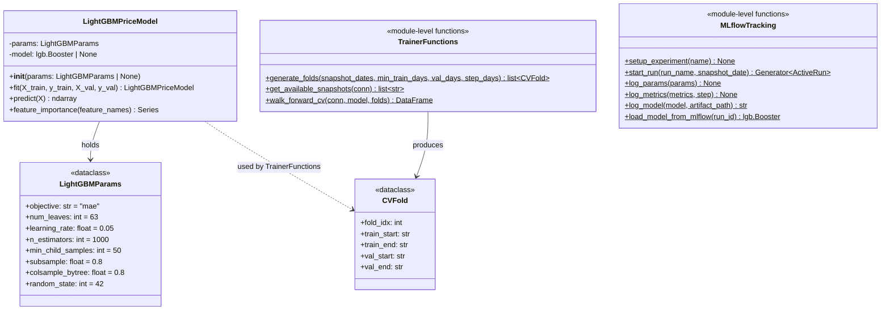

# C4 — LightGBM Model Code

The LightGBM price prediction model is trained on log-return targets using walk-forward cross-validation with MAE loss. The model is a gradient-boosted tree ensemble that predicts 7-day log returns while respecting temporal order, avoiding look-ahead bias in evaluation.



## Class Responsibilities

| Class | Role |
|-------|------|
| **LightGBMParams** | Stores hyperparameters as a dataclass; `vars(params)` is passed directly to `lgb.train()` and `mlflow.log_params()` without conversion. |
| **LightGBMPriceModel** | LightGBM wrapper with scikit-learn-compatible fit/predict interface. Manages training with early stopping and exposes feature importance. |
| **CVFold** | Represents one walk-forward CV fold with ISO date boundaries (train_start, train_end, val_start, val_end). |
| **TrainerFunctions** | Module-level functions that generate folds from available snapshots, run walk-forward CV across all folds, and enforce minimum fold count (3). |
| **MLflowTracking** | Module-level functions that manage MLflow experiment lifecycle: setup, run context management, logging params/metrics/models, and loading models by run_id. |

## Training Target

The target variable is `log_return_7d = log(price_t+7 / price_today)`.

- **Interpretation**: Zero means no price change; positive values indicate a price increase; negative values indicate a decrease.
- **Why log-return**: The distribution of card prices is Pareto-like with a heavy tail. Log-returns compress the scale of extreme outliers, making the prediction problem more tractable. Log-return is also the standard in quantitative finance (it is additive over time: `log_return_14d = log_return_7d + log_return_next_7d`).

## Why MAE Loss

MTG card prices follow a Pareto distribution with tail exponent α ≈ 1.303 (confirmed in statistical_properties/01). Because α < 2, the distribution has **finite mean but infinite theoretical variance**. 

If MSE were used, squared errors would dominate the gradient signal—a single €2,000 card outlier would overwhelm the learning signal for thousands of smaller cards. MAE penalises errors linearly: an error of €1,000 has 10× the loss of a €100 error, but does not compound. This robustness is critical for Pareto-distributed data.

## Walk-Forward Cross-Validation

Price data is a time series. A random train/test split would "jump in time": the model would learn from future data to predict the past, producing misleadingly good evaluation metrics while being useless in production.

**Walk-forward CV guarantees the validation set is always later than training:**

```
Fold 0: train 2026-05-26..2026-06-24, val 2026-06-25..2026-07-01
Fold 1: train 2026-05-26..2026-07-01, val 2026-07-02..2026-07-08
Fold 2: train 2026-05-26..2026-07-08, val 2026-07-09..2026-07-15
```

The training window grows (accumulating more historical data); the validation window advances by `step_days` (default 7 days) without overlap. This mimics real-world production: the model trains on all available historical data and predicts strictly future prices.

**Data gate**: Walk-forward CV requires at least 3 folds. With default parameters (`min_train_days=30`, `val_days=7`, `step_days=7`), the first three folds appear after approximately 50 days of daily snapshots. `generate_folds()` raises `InsufficientDataError` if fewer than 3 folds can be generated, reporting the unlock date.
