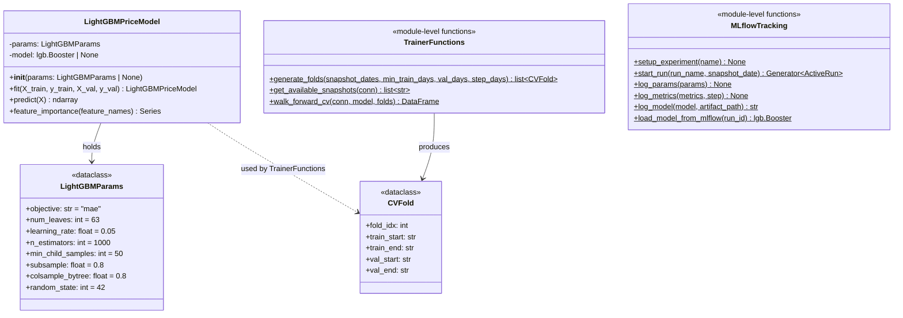

# C4 — LightGBM Model Code

The LightGBM price prediction model is trained on log-return targets using walk-forward cross-validation with MAE loss. The model is a gradient-boosted tree ensemble that predicts 7-day log returns while respecting temporal order, avoiding look-ahead bias in evaluation.


```mermaid
classDiagram
  class LightGBMParams {
    <<dataclass>>
    +objective: str = "mae"
    +num_leaves: int = 63
    +learning_rate: float = 0.05
    +n_estimators: int = 1000
    +min_child_samples: int = 50
    +subsample: float = 0.8
    +colsample_bytree: float = 0.8
    +random_state: int = 42
  }

  class LightGBMPriceModel {
    -params: LightGBMParams
    -model: lgb.Booster | None
    +__init__(params: LightGBMParams | None)
    +fit(X_train, y_train, X_val, y_val) LightGBMPriceModel
    +predict(X) ndarray
    +feature_importance(feature_names) Series
  }

  class CVFold {
    <<dataclass>>
    +fold_idx: int
    +train_start: str
    +train_end: str
    +val_start: str
    +val_end: str
  }

  class TrainerFunctions {
    <<module-level functions>>
    +generate_folds(snapshot_dates, min_train_days, val_days, step_days)$ list~CVFold~
    +get_available_snapshots(conn)$ list~str~
    +walk_forward_cv(conn, model, folds)$ DataFrame
  }

  class MLflowTracking {
    <<module-level functions>>
    +setup_experiment(name)$ None
    +start_run(run_name, snapshot_date)$ Generator~ActiveRun~
    +log_params(params)$ None
    +log_metrics(metrics, step)$ None
    +log_model(model, artifact_path)$ str
    +load_model_from_mlflow(run_id)$ lgb.Booster
  }

  LightGBMPriceModel --> LightGBMParams : holds
  LightGBMPriceModel ..> CVFold : used by TrainerFunctions
  TrainerFunctions --> CVFold : produces
```

## Class Responsibilities

| Class | Role |
|-------|------|
| **LightGBMParams** | Stores hyperparameters as a dataclass; `vars(params)` is passed directly to `lgb.train()` and `mlflow.log_params()` without conversion. |
| **LightGBMPriceModel** | LightGBM wrapper with scikit-learn-compatible fit/predict interface. Manages training with early stopping and exposes feature importance. |
| **CVFold** | Represents one walk-forward CV fold with ISO date boundaries (train_start, train_end, val_start, val_end). |
| **TrainerFunctions** | Module-level functions that generate folds from available snapshots, run walk-forward CV across all folds, and enforce minimum fold count (3). |
| **MLflowTracking** | Module-level functions that manage MLflow experiment lifecycle: setup, run context management, logging params/metrics/models, and loading models by run_id. |

## Training Target

The target variable is `log_return_7d = log(price_t+7 / price_today)`.

- **Interpretation**: Zero means no price change; positive values indicate a price increase; negative values indicate a decrease.
- **Why log-return**: The distribution of card prices is Pareto-like with a heavy tail. Log-returns compress the scale of extreme outliers, making the prediction problem more tractable. Log-return is also the standard in quantitative finance (it is additive over time: `log_return_14d = log_return_7d + log_return_next_7d`).

## Why MAE Loss

MTG card prices follow a Pareto distribution with tail exponent α ≈ 1.303 (confirmed in statistical_properties/01). Because α < 2, the distribution has **finite mean but infinite theoretical variance**. 

If MSE were used, squared errors would dominate the gradient signal—a single €2,000 card outlier would overwhelm the learning signal for thousands of smaller cards. MAE penalises errors linearly: an error of €1,000 has 10× the loss of a €100 error, but does not compound. This robustness is critical for Pareto-distributed data.

## Walk-Forward Cross-Validation

Price data is a time series. A random train/test split would "jump in time": the model would learn from future data to predict the past, producing misleadingly good evaluation metrics while being useless in production.

**Walk-forward CV guarantees the validation set is always later than training:**

```
Fold 0: train 2026-05-26..2026-06-24, val 2026-06-25..2026-07-01
Fold 1: train 2026-05-26..2026-07-01, val 2026-07-02..2026-07-08
Fold 2: train 2026-05-26..2026-07-08, val 2026-07-09..2026-07-15
```

The fold *windows* grow, but each fold *trains on one snapshot*: the last snapshot on or before `train_end`, with earlier history entering only through its lag and rolling features. It is validated on the last snapshot inside the validation window. The validation window advances by `step_days` (default 7) without overlap.

**Data gate**: walk-forward CV requires at least 3 *usable* folds. `fold_is_usable()` keeps a fold only when its validation window contains a snapshot that also has a partner exactly 7 days later (what `build_target()` needs), and `generate_folds()` raises `InsufficientDataError` with both counts when fewer than 3 remain. With uninterrupted daily snapshots that takes about 57 days; gaps in the history remove folds.

*Revised 2026-09-29: an earlier version described this gate as counting calendar span only (13 folds reported, 2 executed). That was fixed in 0.2.0.*

**Label timing — checked 2026-09-30, no leak.** The training target ends at `train_snap + 7`. `fold_is_usable` only accepts a fold when that snapshot exists. If it lies inside the validation window, the validation snapshot (the latest one in the window) is at least that late. Either way, the training label ends *on or before* the validation prediction date: it is information the model would really have on that day. On the three usable folds of 2026-09-30 it ends exactly on the validation date twice and before it once. A purge gap would add nothing.

**Fixed 2026-09-30 — early stopping used the validation fold.** `walk_forward_cv` used to call `model.fit(X_train, y_train, X_val, y_val)`, so early stopping picked the number of trees on the same fold it then scored. It now calls `model.fit(X_train, y_train)`, and the model early-stops on a split of its own training rows. On the three folds of 2026-09-30 this is the difference between LightGBM beating the naive baseline on Tier 1 (MAE 0.02385 vs 0.02399) and losing to it (0.02522 when early stopping uses an internal split of the training data). Most of the gap is fold 0, whose training labels span the July price-feed switch. On the most recent fold LightGBM still wins honestly (0.02577 vs 0.02628).
