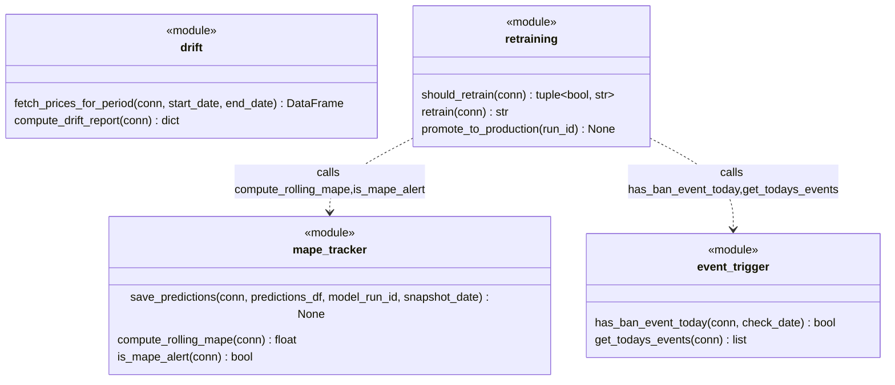

# C4 — Monitoring Modules Code

The monitoring system detects prediction drift and ban events, triggering automatic retraining decisions via a priority-based logic that first checks for ban events (immediate retrain) and then evaluates rolling MAPE degradation over consecutive days.

## Module Responsibilities

| Module | Responsibility |
|--------|-----------------|
| `mape_tracker` | Persists predictions to gold_predictions and computes rolling 7-day MAPE against actual prices; emits MAPE alerts when threshold breached for consecutive days |
| `event_trigger` | Queries gold_events table to detect ban/unban events occurring on a specific date |
| `drift` | Fetches historical EUR prices and runs Evidently KS-test comparing reference (last 30 days) vs current (last 7 days) price distributions |
| `retraining` | Orchestrates retraining decisions, executes LightGBM model training via walk-forward CV, logs to MLflow, and promotes winning models to production |

## Retraining Decision Logic

The `should_retrain()` function checks two independent signals in priority order:

1. **Ban/unban event today** (queries gold_events) → immediate retrain signal
2. **MAPE > 30% for 3 consecutive days** (via `compute_rolling_mape()` and `is_mape_alert()`) → drift-induced retrain signal

If either signal fires, `retrain()` is invoked to build a fresh LightGBM model using walk-forward cross-validation on the snapshot and training on full historical data. The new model is logged to MLflow with a new `run_id`. 

`promote_to_production(run_id)` only promotes a model if its CV MAPE is better than the currently registered Production model in MLflow Registry, ensuring quality gates are enforced.

## Data Sources

| Module | Reads From | Purpose |
|--------|-----------|---------|
| `mape_tracker` | gold_predictions, gold_price_features | Retrieve past predictions and 7-day actual prices for MAPE computation |
| `event_trigger` | gold_events | Detect ban/unban events occurring today |
| `drift` | gold_price_features | Fetch historical EUR prices for distribution analysis |
| `retraining` | gold_events, gold_predictions, gold_price_features | Aggregate signals for retraining decision; source training data for model rebuild |
