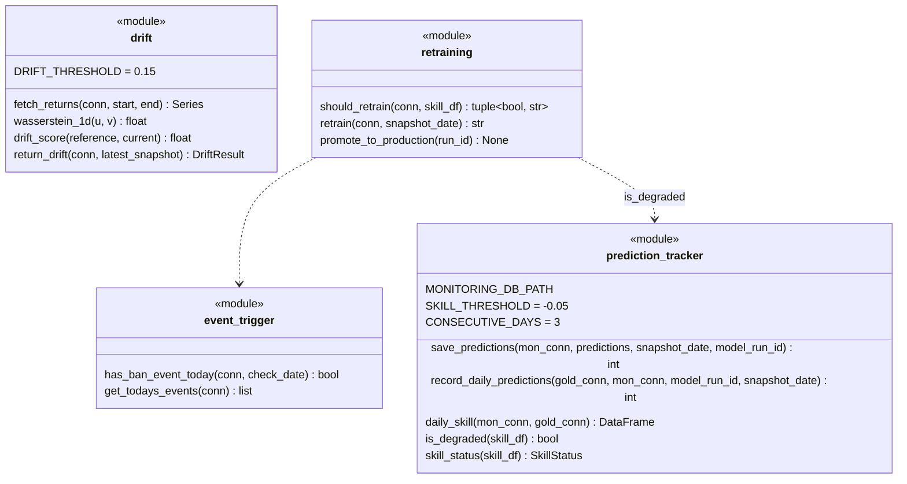

# C4 — Monitoring Modules Code

Module-level view of [ADR-034](../../adr/ADR-034-skill-vs-naive-and-return-drift-monitoring.md). *Revised 2026-09-30; `mape_tracker` and the Evidently-based drift report were removed.*

```mermaid
classDiagram
  class prediction_tracker {
    <<module>>
    MONITORING_DB_PATH
    SKILL_THRESHOLD = -0.05
    CONSECUTIVE_DAYS = 3
    save_predictions(mon_conn, predictions, snapshot_date, model_run_id) int
    record_daily_predictions(gold_conn, mon_conn, model_run_id, snapshot_date) int
    daily_skill(mon_conn, gold_conn) DataFrame
    is_degraded(skill_df) bool
    skill_status(skill_df) SkillStatus
  }

  class drift {
    <<module>>
    DRIFT_THRESHOLD = 0.15
    fetch_returns(conn, start, end) Series
    wasserstein_1d(u, v) float
    drift_score(reference, current) float
    return_drift(conn, latest_snapshot) DriftResult
  }

  class event_trigger {
    <<module>>
    has_ban_event_today(conn, check_date) bool
    get_todays_events(conn) list
  }

  class retraining {
    <<module>>
    should_retrain(conn, skill_df) tuple~bool, str~
    retrain(conn, snapshot_date) str
    promote_to_production(run_id) None
  }

  retraining ..> event_trigger
  retraining ..> prediction_tracker : is_degraded
```

## Module Responsibilities

| Module | Responsibility |
|--------|-----------------|
| `prediction_tracker` | Stores the served model's daily predictions in the monitoring DB (one transaction per day and model, replacing reruns); scores matured dates against the naive forecast; decides degradation |
| `drift` | 7-day log returns from `gold_price_features`; normalised Wasserstein distance between the current week and the previous four; implemented in numpy |
| `event_trigger` | Ban/unban events in `gold_events` on a given date |
| `retraining` | `should_retrain` (ban, then degradation); `retrain` (walk-forward CV, final model, MLflow); `_compare_and_promote` / `promote_to_production` |

## Data

| Store | Table | Written by | Read by |
|---|---|---|---|
| Monitoring DB (`data/monitoring/monitoring.duckdb`) | `predictions(uuid, snapshot_date, eur, predicted_log_return, model_run_id, created_at)` | `save_predictions` | `daily_skill` |
| Gold DB (read-only here) | `gold_price_features` | ETL | features, actual returns, drift |
| Gold DB | `gold_events` | ETL | `event_trigger` |

The monitoring DB is included in `scripts/backup_data.py`: predictions are a record of what the model said on the day and cannot be regenerated.
