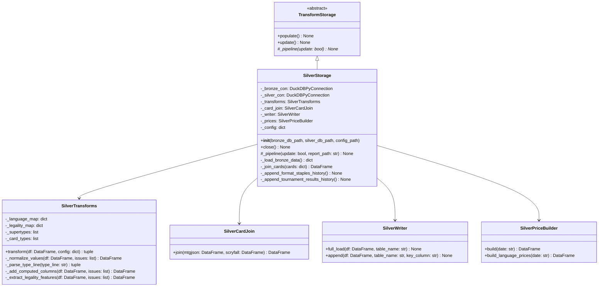

# C4 — SilverStorage Code

The SilverStorage class orchestrates the Bronze → Silver transformation pipeline, applying config-driven cleaning rules to raw data and delegating card merging and price extraction to specialized collaborators.

## Class Responsibilities

| Class | Responsibility |
|-------|-----------------|
| **TransformStorage** | Abstract base defining the populate/update entry points and the internal _pipeline pattern |
| **SilverStorage** | Orchestrate the full Bronze → Silver pipeline: load Bronze tables, apply transforms per source, join cards, append price/meta/tournament history, write issues report |
| **SilverTransforms** | Apply config-driven cleaning rules (row filtering, column drops, JSON parsing, string/numeric/boolean normalization, legality extraction) to each Bronze source table |
| **SilverCardJoin** | Merge MTGJson and Scryfall card data into a unified silver_cards table, resolving conflicts and filtering non-card layouts |
| **SilverWriter** | Provide write primitives (full_load, append) that wrap DuckDB operations with consistency checks |
| **SilverPriceBuilder** | Read scalar EUR/USD columns from `bronze_scryfall_prices_history` and pivot EAV rows from `bronze_mtgjson_prices_history` (via CASE WHEN SQL) to wide price columns; build appending history tables for canonical and language-variant prices |

## Transformation Pipeline

**Sequence:**

1. **Load Bronze data** — `_load_bronze_data()` reads only tables declared in silver_config.json ("sources") into memory, avoiding expensive full-table scans.

2. **Transform each source** — For each source (e.g., mtgjson_cards, scryfall_cards), call `SilverTransforms.transform()` to apply eight stateless cleaning steps (row filtering, column drops, JSON parsing, string/numeric/boolean normalization, column renames) plus three stateful steps (language expansion, legality mapping, type-line parsing). Each transformation returns a cleaned DataFrame and an issues list.

3. **Join cards** — Delegate to `SilverCardJoin.join()` to merge MTGJson and Scryfall data, resolving duplicate names and filtering digital/oversized layouts. Write the merged DataFrame as `silver_cards` using `full_load()` (always a full rebuild, as Scryfall is a daily snapshot).

4. **Extract legality features** — Call `_extract_legality_features()` to expand the legalities dict into five scalar boolean/integer columns (`is_commander_legal`, `is_standard_legal`, `is_modern_legal`, `is_legacy_legal`, `format_count`) and drop the raw dict column.

5. **Append meta history** — Restrict bronze_scryfall_meta_history to IDs present in silver_cards (drop digital/oversized orphans) and append to `silver_meta_history` using deduplication on (scryfall_id, snapshot_date).

6. **Append prices history** — Call `SilverPriceBuilder.build()` to read scalar EUR/USD columns from `bronze_scryfall_prices_history` and pivot EAV rows from `bronze_mtgjson_prices_history` (CASE WHEN SQL in `mtgjson_prices_daily.sql`) to the six wide price columns. Call `build_language_prices()` for language variants. Append both to `silver_prices_history` and `silver_language_prices_history` with deduplication on (scryfall_id, snapshot_date).

7. **Append format/tournament history** — Append bronze_format_staples_history to silver_format_staples_history and bronze_tournament_results (with normalized names and oracle_id/scryfall_id join) to silver_tournament_results_history.

8. **Write issues report** — Call `write_report(all_issues, report_path)` (module-level function in `src.data.cards.storage.silver.report`) to serialize all collected transformation issues (unknown language codes, data type mismatches, split card handling regressions) as JSON for auditing.

**Entry points:**
- `populate()` calls `_pipeline(update=False)` for full rebuild
- `update()` calls `_pipeline(update=True)` for incremental daily run (though silver_cards always rebuilds regardless)
