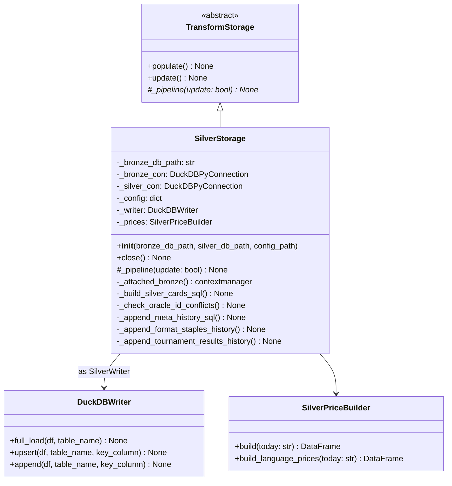

# C4 — SilverStorage Code

`SilverStorage` builds the Silver tier from Bronze. Card data is transformed entirely in DuckDB SQL over a read-only `ATTACH` of the Bronze file ([ADR-024](../../adr/ADR-024-duckdb-compute-layer.md)); only the daily price snapshot is assembled in pandas by `SilverPriceBuilder`.

*Revised 2026-09-29: the previous version described the pandas pipeline (`SilverTransforms`, `SilverCardJoin`, a JSON issues report) that was deleted on 2026-06-20.*

```mermaid
classDiagram
  TransformStorage <|-- SilverStorage
  SilverStorage --> DuckDBWriter : as SilverWriter
  SilverStorage --> SilverPriceBuilder

  class TransformStorage {
    <<abstract>>
    +populate() None
    +update() None
    #_pipeline(update: bool) None*
  }

  class SilverStorage {
    -_bronze_db_path: str
    -_bronze_con: DuckDBPyConnection
    -_silver_con: DuckDBPyConnection
    -_config: dict
    -_writer: DuckDBWriter
    -_prices: SilverPriceBuilder
    +__init__(bronze_db_path, silver_db_path, config_path)
    +close() None
    #_pipeline(update: bool) None
    -_attached_bronze() contextmanager
    -_build_silver_cards_sql() None
    -_check_oracle_id_conflicts() None
    -_append_meta_history_sql() None
    -_append_format_staples_history() None
    -_append_tournament_results_history() None
  }

  class DuckDBWriter {
    +full_load(df, table_name) None
    +upsert(df, table_name, key_column) None
    +append(df, table_name, key_column) None
  }

  class SilverPriceBuilder {
    +build(today: str) DataFrame
    +build_language_prices(today: str) DataFrame
  }
```

## Class Responsibilities

| Class | Responsibility |
|-------|-----------------|
| **TransformStorage** | Abstract base defining the `populate`/`update` entry points and the `_pipeline` hook (`src/data/cards/storage/base/transformer.py`) |
| **SilverStorage** | Run the six Silver steps below; owns the Bronze `ATTACH` and the SQL files in `src/data/cards/storage/silver/sql/` (`src/data/cards/storage/silver/storage.py`) |
| **DuckDBWriter** | Shared write primitives for every tier — full load, upsert, and anti-join append keyed on `(key, snapshot_date)` (`src/data/cards/storage/base/writers.py`) |
| **SilverPriceBuilder** | Today's price snapshot: scalar Scryfall EUR/USD columns (`scryfall_prices_daily.sql`) plus MTGJson EAV rows pivoted to wide columns (`mtgjson_prices_daily.sql`), forward-filled from history; a separate build for language-variant cards (`src/data/cards/storage/silver/prices.py`) |

## Transformation Pipeline

`_pipeline` runs the same steps for `populate()` and `update()` — the `update` flag is unused, because `silver_cards` is always rebuilt and every history table is appended with de-duplication anyway.

1. **silver_cards** — `silver_cards.sql` joins MTGJson and Scryfall cards over the attached Bronze file (MTGJson has priority, [ADR-009](../../adr/ADR-009-mtgjson-priority-card-join-strategy.md)), cleans strings and types, and derives legality columns. Full rebuild. `_check_oracle_id_conflicts` then logs cards whose oracle_id maps to more than one name.
2. **meta history** — `silver_meta_history_transform.sql` restricts `bronze_scryfall_meta_history` to cards present in `silver_cards` and appends new `(scryfall_id, snapshot_date)` rows to `silver_meta_history`.
3. **checkpoint** — flushes the DuckDB WAL before the pandas steps.
4. **prices** — `SilverPriceBuilder.build(today)` → appended to `silver_prices_history`.
5. **language prices** — `SilverPriceBuilder.build_language_prices(today)` → appended to `silver_language_prices_history`.
6. **format staples and tournaments** — `bronze_format_staples_history` → `silver_format_staples_history`; `bronze_tournament_results`, with card names normalised and joined to oracle_id / scryfall_id → `silver_tournament_results_history`.

`configs/silver_config.json` is loaded in `__init__` but not read by any step (see the ADR-007 amendment).
