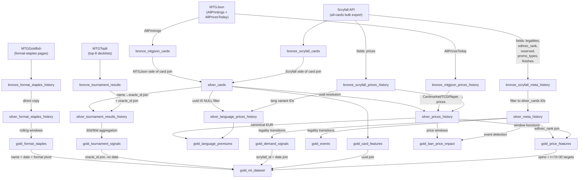

# Data Lineage

How data flows from external sources through Bronze → Silver → Gold. For column-level types and descriptions, see [table-schemas.md](table-schemas.md).

---

## Overview Diagram

---

## Path 1: Card Catalog

**Route:** Scryfall + MTGJson → Bronze → `silver_cards` → `gold_card_features`

**Bronze → Silver (`silver_cards`)**

`SilverCardJoin.join()` merges `bronze_mtgjson_cards` and `bronze_scryfall_cards` into one unified catalog:

1. MTGJson `identifiers.scryfall_id` is used to join the two sources on Scryfall ID.
2. Non-card layouts (tokens, art series, oversized, digital) are filtered out.
3. MTGJson provides: `uuid`, `name`, `set_code`, `language`, `mana_value`, `rarity`, `finishes`, `colors`, `color_identity`, `variations`, `original_supertypes`, `is_*` boolean flags, `edhrec_saltiness`.
4. Scryfall provides: `scryfall_id` (as `id`), `oracle_id`, `set_type`.
5. `canonical_uuid` is set to the MTGJson `uuid` of the English paper printing; non-English variants (MTGJson `uuid IS NULL`) inherit it via `(set_code, collector_number)` resolution.
6. `SilverTransforms._extract_legality_features()` expands the raw `legalities` JSON dict into five scalar boolean columns (`is_commander_legal` etc.) and `format_count`.

**Silver → Gold (`gold_card_features`)**

`GoldFeatureBuilders.build_card_features()` reads `silver_cards WHERE uuid IS NOT NULL`:

- Derives `finish_count` (len of finishes array), `has_etched_finish`, `color_count`, `color_identity_count`, `variation_count`, `is_legendary` (from `original_supertypes`).
- Caps `mana_value` at 20 (corrupted Bronze entries observed above this threshold).
- Computes `print_count` as the count of distinct `uuid` values per `oracle_id`.
- Excludes Scryfall-only rows (uuid IS NULL) to prevent NULL-key fan-outs in downstream joins.
- Does **not** include `edhrec_rank` — it is snapshotted daily in `silver_meta_history` and time-aligned into `gold_price_features` instead.

---

## Path 2: Price History

**Route:** Scryfall + MTGJson → Bronze → `silver_prices_history` → `gold_price_features`

**Bronze → Silver (`silver_prices_history`)**

`SilverPriceBuilder.build()` runs daily, reading only today's rows:

1. Reads today's `bronze_scryfall_prices_history` via `scryfall_prices_base.sql` — selects scalar `eur`, `eur_foil`, `usd`, `usd_foil` float columns directly (no JSON parsing).
2. Joins to `silver_cards` on `scryfall_id` to resolve `uuid`. Falls back to `canonical_uuid` for cards whose direct join misses (stale MTGJson scryfall_id).
3. Reads today's `bronze_mtgjson_prices_history` via `mtgjson_prices_daily.sql` — pivots EAV rows `(retailer, tx_type, finish, price)` into six wide columns (`cardmarket_eur`, `cardmarket_eur_foil`, `cardmarket_buylist_eur`, `tcgplayer_usd`, `tcgplayer_usd_foil`, `tcgplayer_buylist_usd`) using `MAX(CASE WHEN ...)` aggregation per `(uuid, snapshot_date)`.
4. Left-joins MTGJson prices onto the Scryfall base on `(uuid, snapshot_date)`.
5. Forward-fills rows where all price columns are NULL from the most recent prior `silver_prices_history` row.

**Silver → Gold (`gold_price_features`)**

`GoldFeatureBuilders.build_price_features()` runs DuckDB window functions over the full `silver_prices_history`:

- Computes rolling averages (`price_7d_avg`, `price_30d_avg`) using `ROWS BETWEEN N PRECEDING AND CURRENT ROW`.
- Computes lag-based absolute and percentage changes using pre-computed `lag_1d`, `lag_7d`, `lag_30d` CTEs.
- Computes `price_volatility_30d` (30-row stddev), `foil_premium`, all-time high/low, `days_with_price`, `price_rank_global` (global rank by EUR on each date), and `is_price_spike` (>300% day-over-day change flag).
- Time-aligns `edhrec_rank` from `silver_meta_history` via LEFT JOIN on `(scryfall_id, snapshot_date)`.

---

## Path 3: Language Variant Prices

**Route:** Scryfall → Bronze → `silver_language_prices_history` → `gold_language_premiums`

**Bronze → Silver (`silver_language_prices_history`)**

`SilverPriceBuilder.build_language_prices()` runs daily, targeting non-English variants:

1. Queries `silver_cards WHERE uuid IS NULL AND canonical_uuid IS NOT NULL` to get the language variant ID list.
2. Reads today's `bronze_scryfall_prices_history` filtered to those IDs.
3. Joins language code (`lang`) from `bronze_scryfall_cards`.
4. Forward-fills all-NULL rows from prior `silver_language_prices_history`.

**Silver → Gold (`gold_language_premiums`)**

`GoldFeatureBuilders.build_language_premiums()` performs an INNER JOIN:

- Joins `silver_language_prices_history` to `silver_prices_history` on `(canonical_uuid, snapshot_date)` to get the English canonical price on the same day.
- Computes `eur_lang_premium = lang_eur / NULLIF(canonical_eur, 0)` and `eur_foil_lang_premium`.

---

## Path 4: Format Staples

**Route:** MTGGoldfish → Bronze → `silver_format_staples_history` → `gold_format_staples`

**Bronze → Silver (`silver_format_staples_history`)**

Direct copy from `bronze_format_staples_history` via append with deduplication on `(id, snapshot_date)`. No transformations applied.

**Silver → Gold (`gold_format_staples`)**

`GoldSignalBuilders.build_format_staples()` runs DuckDB window functions:

- `deck_pct_7d_avg` and `deck_pct_30d_avg`: rolling averages using `ROWS BETWEEN N PRECEDING AND CURRENT ROW` partitioned by `id`.
- `deck_pct_change_7d` and `deck_pct_change_30d`: lag-based deltas using `LAG(deck_pct, 7/30) OVER (PARTITION BY id ORDER BY snapshot_date)`.

---

## Path 5: Tournament Results

**Route:** MTGTop8 → Bronze → `silver_tournament_results_history` → `gold_tournament_signals`

**Bronze → Silver (`silver_tournament_results_history`)**

`SilverStorage._append_tournament_results_history()` normalizes and appends:

1. Joins `bronze_tournament_results` to `silver_cards` on normalized card name to resolve `oracle_id` and `scryfall_id`.
2. Appends with deduplication on the composite `id` key.

**Silver → Gold (`gold_tournament_signals`)**

`GoldSignalBuilders.build_tournament_signals()` aggregates in SQL:

- Groups by `(oracle_id, format)`.
- Counts distinct tournament IDs where `days_ago <= 30` and `days_ago <= 90` for main-deck appearances.
- Averages `copies` for main-deck rows.
- Computes `main_deck_pct` as 90-day main-deck appearances / total 90-day appearances.
- Uses `CURRENT_DATE` date arithmetic (not row-based windowing) because tournament dates are sparse.

---

## Cross-Table Join Keys

| Join | Left table | Left key | Right table | Right key | Note |
|------|-----------|----------|------------|----------|------|
| Card catalog merge | bronze_mtgjson_cards | identifiers.scryfall_id | bronze_scryfall_cards | id | Resolved during SilverCardJoin |
| UUID resolution | bronze_scryfall_prices_history | id (scryfall_id) | silver_cards | scryfall_id | COALESCE(uuid, canonical_uuid) for fallback |
| Metadata filter | bronze_scryfall_meta_history | id | silver_cards | scryfall_id | Restrict to paper non-digital cards |
| Tournament name join | bronze_tournament_results | card_name | silver_cards | name | Normalized card name match |
| Price features meta | silver_prices_history | scryfall_id + snapshot_date | silver_meta_history | id + snapshot_date | Time-aligned EDHREC rank |
| Language premium | silver_language_prices_history | canonical_uuid + snapshot_date | silver_prices_history | uuid + snapshot_date | Same-day canonical price |
| ML dataset card | gold_price_features | uuid | gold_card_features | uuid | Static join, no date |
| ML dataset signals | gold_price_features | scryfall_id + snapshot_date | gold_demand_signals | id + snapshot_date | Time-aligned |
| ML dataset tournament | gold_card_features | oracle_id | gold_tournament_signals | oracle_id | Cross-sectional, no date dimension |
| ML dataset staples | gold_card_features + gold_price_features | name + snapshot_date | gold_format_staples | card_name + snapshot_date + format | Oracle-level name match; pivoted to 4 format columns |
